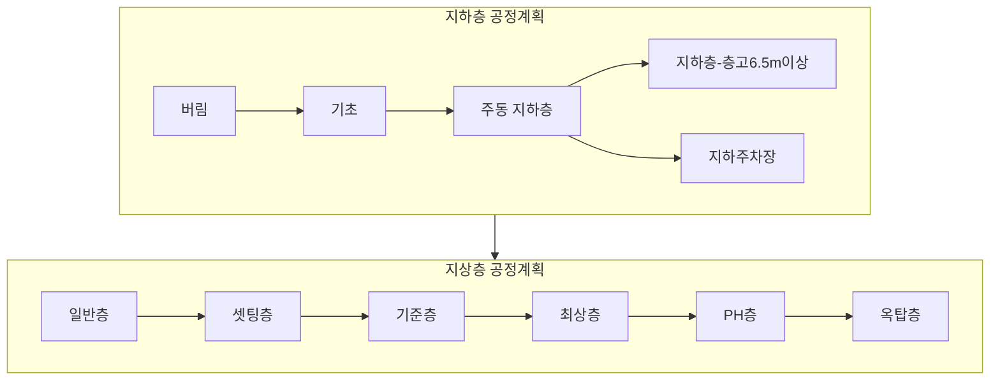

# ConTech-DX 공정계획 도메인 기획안

건축직영공사(골조 공사)의 공정계획 수립 시스템에 대한 전반적인 도메인 분석 문서입니다.

---

## 1. 시스템 개요

ConTech-DX의 공정계획 모듈은 **아파트 골조 직영공사**의 공정일수를 자동 산출하고, 이를 간트차트로 변환하여 시각화합니다. 기존 엑셀 기반의 "골조표준공정 일수고정 산식표"를 디지털화한 시스템입니다.

### 핵심 워크플로우


| 단계 | 설명 | 주요 데이터 |
|------|------|-------------|
| 동 설정 | 동 기본정보 (층수, 코어, 구조형식, 층고) 입력 | `Building`, `BuildingMeta`, `Floor` |
| 물량 입력 | 층별·공종별 물량 (거푸집, 철근, 콘크리트 등) 입력 | `FloorTrade`, `TradeData` |
| 공정 로직 | 세부공정 모듈의 일생산량, 계산 기준 확인/편집 | `ProcessModule`, `ProcessItem` |
| 공정계획 | 공정타입 선택 → 일수 자동 계산 → 수동 조정 | `BuildingProcessPlan` |
| 간트차트 | 공정계획을 태스크로 변환, 순차 스케줄링 | `ConstructionTask` |

---

## 2. 데이터 모델

### 2.1 동(Building) 구조

```
Building
├── id, projectId, buildingName, buildingNumber
├── meta: BuildingMeta
│   ├── totalUnits (총 세대수)
│   ├── coreCount, coreType (코어 수/타입)
│   ├── slabType (구조형식: 벽식구조/RC구조 등)
│   ├── floorCount
│   │   ├── basement (지하층 수)
│   │   ├── ground (지상층 수)
│   │   ├── ph (옥탑층 수)
│   │   └── coreGroundFloors[] (코어별 지상층 수)
│   ├── heights
│   │   ├── basement1, basement2 (지하층 층고)
│   │   ├── standard (기준층 층고)
│   │   ├── floor1~floor5 (개별층 층고)
│   │   ├── top (최상층 층고)
│   │   └── ph (PH층 층고)
│   ├── standardFloorCycle (기준층 공정사이클)
│   └── pumpCarCount (펌프카 최대 투입대수)
├── floors: Floor[]
│   ├── floorLabel ("B2", "1F", "PH1" 등)
│   ├── floorNumber (정렬용 숫자)
│   ├── levelType (지하/지상)
│   ├── floorClass (지하층/일반층/셋팅층/기준층/최상층/PH층/옥탑층)
│   └── height (층고)
└── floorTrades: FloorTrade[]
    ├── tradeGroup ("버림", "기초", "아파트" 등)
    └── trades: TradeData
        ├── gangForm (갱폼: areaM2, productivity, workers, cost)
        ├── alForm (알폼)
        ├── formwork (형틀)
        ├── euroForm (유로폼)
        ├── stripClean (해체/정리)
        ├── rebar (철근: ton, wall, beamSlab)
        └── concrete (콘크리트: volumeM3, equipmentCount)
```

### 2.2 공정계획(BuildingProcessPlan)

```
BuildingProcessPlan
├── processes
│   └── [ProcessCategory]: {
│       ├── days (공정일수)
│       ├── processType (선택된 공정타입)
│       ├── floors (층별 공정타입 오버라이드)
│       └── floorDetails (층별 상세: 일수, 항목별 계산결과)
│   }
├── totalDays (합계일수)
├── itemDirectWorkDaysOverrides (순작업일 수동 오버라이드)
├── temporaryWorkDays (가설공사 일수)
├── earthRetentionWorkDays (흙막이 일수)
├── earthworkWorkDays (토공사 일수)
└── specialRowQuantities (주차장/가시설 특수행 물량)
```

---

## 3. 공정 카테고리 체계

건축 골조공사는 시공 순서에 따라 **11개 카테고리**로 구분됩니다.

### 시공 순서



> [!NOTE]
> 주동 지하층, 지하층(6.5m이상), 지하주차장은 **병렬 배치**됩니다 (동일 시작일).

| 카테고리 | 설명 | 특징 |
|---------|------|------|
| **버림** | 기초 하부 버림콘크리트 타설 | 일수고정 방식, 2개 항목 (틀설치+타설) |
| **기초** | 기초 골조 (먹매김~타설) | 끊어치기+타설은 장비기반, 나머지 일수고정 |
| **주동 지하층** | 지하층 골조 (B1, B2 등) | 층별 물량 참조, 특수행(주차장/고천장) 차감 |
| **지하층(6.5m이상)** | 층고 6.5m 이상 지하층 | B1+B2 합산 물량, 별도 모듈 |
| **지하주차장** | 지하주차장 골조 | 일반 버전/합벽 버전/일체타설 3가지 |
| **셋팅층** | 지상 1층 (필로티 등) | 기준층과 다른 물량 참조 |
| **기준층** | 반복 구간 (2F~nF) + 최상층 | 표준공정, UI에서 최상층 행 포함 |
| **일반층** | 개방형 구조 층 | 별도 모듈 (유로폼 설치+해체 포함, 6개 항목) |
| **최상층** | 최상층 골조 | 별도 모듈 (6개 항목), UI에서는 기준층 행에 통합 |
| **PH층** | 옥상 기계실 등 | 표준공정, PH1~PH2, 옥탑층 모듈 재사용 |
| **옥탑층** | 최상부 구조물 | 옥탑1, 옥탑2, PH층과 모듈 공유 |

---

## 4. 세부공정 모듈 (ProcessModule)

각 카테고리에는 세부 공종 항목(ProcessItem)들로 구성된 **모듈**이 있습니다. 모듈은 `lib/data/process-modules.ts`에 정의되어 있으며, 현재 **10개 카테고리의 표준공정 모듈**이 존재합니다 (PH층은 별도 모듈 없이 옥탑층 모듈을 재사용).

| 카테고리 | 모듈 ID | 항목 수 |
|---------|---------|--------|
| 버림 | `blinding-standard` | 2 |
| 기초 | `foundation-standard` | 4 |
| 셋팅층 | `setting-standard` | 6 |
| 기준층 | `standard-standard` | 6 |
| 최상층 | `top-standard` | 6 |
| 옥탑층 | `ph-standard` (category: '옥탑층') | 7 |
| 일반층 | `general-standard` | 6 |
| 주동 지하층 | `basement-with-pit` | 13 |
| 지하층(6.5m이상) | `basement-high-ceiling` | 8 |
| 지하주차장 | `parking-standard` | 14 |

### 4.1 ProcessItem 주요 필드

```typescript
interface ProcessItem {
  id: string;              // 고유 식별자
  workItem: string;        // 작업명 (먹매김, 행갈이, 타설, 해체 등)
  unit: string;            // 단위 (㎡, ㎥, TON 등)

  // 물량 참조
  quantityRef?: SemanticQuantityReference;  // 의미론적 참조 (신규)
  quantityReference?: string;               // Excel 셀 참조 (레거시)

  // 계산 파라미터
  dailyProductivity: number;   // 인당 1일 작업량
  calculationBasis?: string;   // 계산방식 (일수고정/물량기반/장비기반)
  equipmentCount: number;      // 장비대수
  directWorkDays?: number;     // 직영 순작업일 (고정값일 때)
  indirectDays: number;        // 간접작업일 (양생, 검측 등)
  indirectWorkItem?: string;   // 간접작업 항목명

  // 장비기반 계산용
  equipmentCalculationBase?: number;   // 대당 타설량 기준값
  equipmentWorkersPerUnit?: number;    // 장비당 인원수
  equipmentName?: string;              // 투입장비명 (예: 콘크리트 펌프차)

  // 층별 구분
  floorLabel?: string;             // 층 라벨 ("B2", "B1" 등, 층별 항목 필터링용)

  // UI 참조용 (엑셀 J~N열)
  teamWorkerCount?: number;        // J: 작업조 기준인원
  baseWorkerCount?: number;        // K: 기준 인원
  maxTeams?: number;               // L: 최대 작업조
  adjustmentCoefficient?: number;  // M: 부분별 보정계수
  maxInputWorkers?: number;        // N: 최대투입인원
}
```

### 4.2 기준층 / 최상층 표준공정 (6개 항목)

| 순서 | 공종명 | 단위 | 계산 기준 | 간접 |
|------|-------|------|----------|------|
| 1 | 먹매김 | - | 일수고정 (1일) | - |
| 2 | 갱폼 설치 | ㎡ | 일수고정 (1일) | 보강/검측 1일 |
| 3 | 벽 철근조립 | TON | 일수고정 (1일) | 검측 0.5일 |
| 4 | 알폼 조립 | ㎡ | 일수고정 (1일) | 검측 0.5일 |
| 5 | 보슬라브 철근조립 | TON | 일수고정 (1일) | 검측 0.5일 |
| 6 | 타설 | ㎥ | 장비기반 (펌프차) | 양생 2일 |

### 4.3 일반층 표준공정 (6개 항목)

| 순서 | 공종명 | 단위 | 계산 기준 | 간접 |
|------|-------|------|----------|------|
| 1 | 먹매김 | - | 일수고정 (1일) | - |
| 2 | 벽 철근조립 | ton | 일수고정 (1일) | 검측 0.5일 |
| 3 | 유로폼 설치 | ㎡ | 일수고정 (6일) | 검측 0.5일 |
| 4 | 보슬라브 철근조립 | ton | 일수고정 (1일) | 검측 0.5일 |
| 5 | 타설 | ㎥ | 장비기반 (펌프차) | 양생 2일 |
| 6 | 거푸집 해체/정리 | ㎡ | 일수고정 (1일) | - |

> [!NOTE]
> 기준층/최상층은 **갱폼+알폼** 기반, 일반층은 **유로폼+해체** 기반으로 항목 구성이 다릅니다.

---

## 5. 일수 계산 방식

공정일수는 세 가지 방식으로 계산됩니다. 모든 계산은 엑셀의 "골조표준공정 일수고정 산식표" 수식을 JavaScript로 구현한 것입니다.

### 5.1 일수고정 (Fixed Days)

```
직영 순작업일 = 사전 정의된 고정값 (예: 먹매김 1일, 검측 0.5일)
총작업일수 = 직영 순작업일 + 간접일
```

적용: 먹매김, 검측, 행갈이 등 물량과 무관한 항목

### 5.2 물량기반 (Quantity Based)

```
총 작업인원 = CEIL(수량 ÷ 인당 1일 작업량)
1일 투입인원 = CEIL(총작업인원 ÷ 장비대수)
직영 순작업일 = f(수량, 인당작업량, 1일투입인원)  // 0.5 기준 반올림/내림
총작업일수 = 직영 순작업일 + 간접일
```

적용: 철근, 형틀 해체, 행갈이 등

### 5.3 장비기반 (Equipment Based)

```
장비대수 = CEIL(MIN(최대대수, 수량 ÷ 대당타설량))
1일 투입인원 = 장비대수 × 장비당 인원수
직영 순작업일 = f(수량, 인당작업량, 1일투입인원)  // 반올림 로직
총작업일수 = 직영 순작업일 + 간접일
```

적용: 콘크리트 타설 (펌프카 기준)

### 5.4 반올림 로직 (엑셀 K열 수식)

```
결과 = 수량 ÷ (인당작업량 × 1일투입인원)
소수점이 0.5 미만 → 내림 (최소 1)
소수점이 0.5 이상 → 올림 (최소 1)
```

---

## 6. 물량 해석 시스템 (SemanticQuantityReference)

공정 항목이 참조하는 물량을 **의미론적으로** 정의합니다. 기존 Excel 셀 주소(`D6`, `B14*0.45`) 대신 도메인 용어를 사용합니다.

### 6.1 공종 필드 매핑

| 필드 키 | 한글 | 서브필드 | Excel 컬럼 |
|---------|------|---------|-----------|
| `gangForm` | 갱폼 | `areaM2` (㎡) | B |
| `alForm` | 알폼 | `areaM2` (㎡) | C |
| `formwork` | 형틀 | `areaM2` (㎡) | D |
| `euroForm` | 유로폼 | `areaM2` (㎡) | U |
| `stripClean` | 해체/정리 | `areaM2` (㎡) | E |
| `rebar` | 철근 | `ton` (TON) | F |
| `concrete` | 콘크리트 | `volumeM3` (㎥) | G |

### 6.2 물량 소스 타입

| 소스 타입 | 설명 | 사용 예 |
|-----------|------|--------|
| `category` | tradeGroup으로 필터링하여 합산 | 버림, 기초 (전체 동 물량) |
| `floor` | 특정 층의 물량을 직접 조회 | 기준층, 셋팅층, 옥탑층 (층별) |
| `combined` | 여러 층의 물량을 합산 | 지하층(6.5m이상) B1+B2 합산 |

### 6.3 차감 로직 (주동 지하층)

주동 지하층 물량에서 특수행(주차장, 3단 가시설, 6.5m이상)의 물량을 차감합니다:

```
주동 지하층 순작업일 = f(전체 물량 - 주차장 물량 - 가시설 물량 - 6.5m이상 물량)
```

---

## 7. 공정 타입 옵션

각 카테고리별로 선택 가능한 공정 타입이 다릅니다.

### 지상층

| 카테고리 | 사용 가능 공정 타입 | 기본값 |
|---------|-------------------|--------|
| 셋팅층 | 표준공정 | 표준공정 |
| 기준층 | 표준공정 | 표준공정 |
| 최상층 | 표준공정 | 표준공정 |
| 일반층 | 표준공정 | 표준공정 |
| PH층 | 표준공정 | 표준공정 |
| 옥탑층 | 표준공정 | 표준공정 |

### 지하층

| 카테고리 | 사용 가능 공정 타입 | 기본값 |
|---------|-------------------|--------|
| 버림 | 표준공정 | 표준공정 |
| 기초 | 표준공정 | 표준공정 |
| 주동 지하층 | 표준공정 | 표준공정 |
| 지하층(층고6.5m이상) | 표준공정 | 표준공정 |
| 지하주차장 | 표준공정 | 표준공정 |

> [!IMPORTANT]
> - 지상층 UI 테이블(PROCESS_CATEGORIES)은 `['일반층', '셋팅층', '기준층', '옥탑층']` 4행
> - **기준층** 행: `floorClass === '기준층' || '최상층'`인 층을 모두 포함 (최상층은 별도 모듈로 계산)
> - **옥탑층** 행: `floorClass === '옥탑층'`만 포함
> - **PH층**: floorClass가 `'PH층'`인 층은 별도 행으로 표시, 옥탑층 모듈 재사용

**현재 모든 카테고리는 표준공정만 사용합니다.** 사이클 기반 공정은 향후 확장 예정입니다.

---

## 8. 간트차트 변환

공정계획은 `process-to-gantt-converter.ts`를 통해 간트차트 태스크로 자동 변환됩니다.

### 계층 구조

```
BLOCK (동: "101동")
├── CP (카테고리: "기초")
│   └── GROUP (층: "")
│       └── TASK: "먹매김" (1일)
│       └── TASK: "기초철근조립" (6일 + 검측 0.5일)
│       └── TASK: "기초타설" (계산 + 양생 3일)
├── CP (카테고리: "기준층")
│   ├── GROUP (층: "2F")
│   │   └── TASK: "먹매김" (1일)
│   │   └── TASK: "갱폼 설치" (1일 + 보강/검측 1일)
│   │   └── ...
│   ├── GROUP (층: "3F")
│   │   └── ...
```

### 카테고리 시공 순서 (CATEGORY_ORDER)

```
버림 → 기초 → 주동 지하층 ⇉ 지하층(6.5m이상) → 일반층 → 셋팅층 → 기준층 → 최상층 → PH층 → 옥탑층
              └─→ 지하주차장 ⇉ (병렬 배치)
```

> [!NOTE]
> 주동 지하층, 지하층(6.5m이상), 지하주차장은 동일 시작일로 **병렬 배치**됩니다. 세 카테고리 중 가장 늦게 끝나는 종료일 이후 다음 카테고리가 시작됩니다.

### 스케줄링 규칙

1. **순차 스케줄링:** 한 층의 세부공종은 이전 항목 종료 후 시작
2. **카테고리 순서:** 시공 순서대로 (버림→기초→지하→...→옥탑)
3. **달력일 적용:** 간접작업일(양생, 검측)은 달력일(calendar days)로 계산
4. **작업일 적용:** 직영 순작업일은 작업일(working days)로 계산
5. **휴일 설정:** 토요일/일요일/공휴일 작업 여부 설정 가능

### 변환 옵션

```typescript
interface ProcessToGanttOptions {
  buildings: Building[];
  processPlans: Map<string, BuildingProcessPlan>;
  projectStartDate: Date;
  holidays?: Date[];
  calendarSettings?: {
    workOnSaturdays: boolean;  // 토요일 작업 (기본: true)
    workOnSundays: boolean;    // 일요일 작업 (기본: false)
    workOnHolidays: boolean;   // 공휴일 작업 (기본: false)
  };
}
```

---

## 9. UI 구조

### 9.1 건물 관리 탭 구조

```
Building Tabs
├── 기본정보        → BuildingBasicInfoPage (동 생성/수정, 층수/코어/층고)
├── 지질정보        → GeologicalDataPage
├── 층설정          → FloorSettingsTable (층 분류/높이 설정)
├── 물량입력        → QuantityInputPage (요약), DataInputPage (상세)
├── 상세물량입력    → DetailedQuantityInputPage
├── 단가입력        → PlannedUnitRatePage (계획/실행 내역)
├── 타설구간 검토   → PouringSectionReviewPage
├── 공정로직        → ProcessLogicPage (세부공정 모듈 편집)
├── 지하층 공정계획 → BasementProcessPlanPage (버림, 기초, 주동 지하층)
├── 지상층 공정계획 → BuildingProcessPlanPage (셋팅층~옥탑층)
└── AI 챗봇 사이드바 → ProcessPlanChatbotSidebar
```

### 9.2 공정계획 페이지 기능

**지하층 공정계획 (BasementProcessPlanPage):**
- 가설공사/흙막이/토공사 일수 직접 입력
- 버림, 기초, 주동 지하층 카테고리
- 주차장/3단가시설/6.5m이상 특수행 물량 입력 및 차감 자동계산
- 층별(B1, B2) 공정타입 개별 설정

**지상층 공정계획 (BuildingProcessPlanPage):**
- UI 테이블 카테고리: 일반층, 셋팅층, 기준층, 옥탑층 (PROCESS_CATEGORIES)
- 기준층 행에 최상층(floorClass='최상층')이 통합 표시
- PH층은 floorClass='PH층'인 층이 별도 행으로 표시 (옥탑층 모듈 재사용)
- 셋팅층/일반층/PH층 모두 표준공정만 사용
- 층별 상세 패널 (ProcessDetailPanel): 항목별 물량, 순작업일, 투입인원 확인
- 순작업일 수동 오버라이드 기능
- 동별 주요정보 카드 (총 세대수, 코어 수, 펌프카 대수)

### 9.3 공정 로직 편집 (ProcessLogicPage)

관리자 전용 페이지로, 세부공정 모듈의 파라미터를 수정할 수 있습니다:

- 공정 모듈별 항목 확인 (카테고리별 그룹핑)
- 계산 공식 섹션 (FormulaSection)
- 사이클 정의 섹션 (CycleDefinitionSection)
- 모듈 편집 모달 (ProcessModuleEditModal)
- 부위별 대당 타설량 변경
- 기본값 복원 기능

---

## 10. 기술 구현 상세

### 10.1 주요 파일 맵

| 영역 | 파일 | 역할 |
|------|------|------|
| **데이터** | `lib/data/process-modules.ts` (1,241줄) | 10개 공정모듈 정의 (PH층은 옥탑층 모듈 공유) |
| **타입** | `lib/types.ts` (662~741줄) | ProcessCategory, BuildingProcessPlan 등 |
| **타입** | `lib/types/process-quantity.ts` | SemanticQuantityReference |
| **계산** | `lib/utils/process-calculation.ts` | 일수 계산 함수 14개 |
| **계산** | `lib/utils/process-days-calculator.ts` | 모듈별/층별 일수 계산 |
| **물량해석** | `lib/utils/process-quantity-resolver.ts` | SemanticRef 기반 물량 해석 |
| **물량참조** | `lib/utils/quantity-reference.ts` | Excel 셀 주소 기반 물량 조회 |
| **변환** | `lib/utils/process-to-gantt-converter.ts` (862줄) | 공정계획→간트 변환 |
| **UI** | `components/buildings/BuildingProcessPlanPage.tsx` (2,154줄) | 지상층 공정계획 |
| **UI** | `components/buildings/BasementProcessPlanPage.tsx` (2,334줄) | 지하층 공정계획 |
| **UI** | `components/buildings/ProcessLogicPage.tsx` | 공정 로직 편집 |

### 10.2 데이터 저장

| 데이터 | 저장소 | 비고 |
|--------|--------|------|
| Building, Floor, FloorTrade | Supabase (getBuildings) | 운영 중 (localStorage 캐시 없음) |
| BuildingProcessPlan | localStorage | Supabase 이관 예정 |
| 공정 모듈 (수정본) | localStorage | 기본값은 코드 내 하드코딩 |
| 간트차트 태스크 | Supabase | 운영 중 |
| 프로젝트 | Supabase | 운영 중 |

### 10.3 AI 챗봇 연동

공정계획 페이지에는 Gemini API 기반 **AI 공정 상담 챗봇**이 사이드바로 통합되어 있습니다:

- 현재 동의 공정계획 컨텍스트를 자동 주입
- 공정 관련 질의응답 (예: "기준층 6일 사이클을 5일로 줄이려면?")
- 빠른 질문 버튼 (QuickQuestionButtons)

---

## 11. 용어 사전

| 용어 | 영문 | 설명 |
|------|------|------|
| 갱폼 | Gang Form | 대형 거푸집 시스템, 벽체 타설에 사용 |
| 알폼 | Al Form | 알루미늄 거푸집, 슬라브 타설에 사용 |
| 유로폼 | Euro Form | 유럽식 거푸집, 범용 |
| 행갈이 | - | 거푸집 위치 이동/전환 작업 |
| 먹매김 | - | 측량 기준점 표시 작업 |
| 해체/정리 | Strip & Clean | 양생 완료 후 거푸집 해체 |
| 양생 | Curing | 콘크리트 타설 후 경화 기간 |
| 검측 | Inspection | 품질 검사 |
| 사이클 | Cycle | 한 층 골조 완성에 소요되는 일수 (5~8일) |
| 타설 | Concrete Pouring | 콘크리트 타설 |
| 펌프카 | Pump Car | 콘크리트 압송 장비 |
| 셋팅층 | Setting Floor | 지상 1층 (기준층과 구조/공정이 다른 층) |
| 필로티 | Pilotis | 지상 1층을 주차장 등으로 활용하는 구조 |
| 직영공사 | Direct Construction | 하도급 없이 직접 시공 |
| 간접공사 | Indirect Work | 양생, 검측 등 직접 시공 외 작업 |
| 물량 | Quantity | 공종별 시공 수량 (면적, 체적, 중량) |
| 순작업일 | Net Work Days | 직접 시공에 소요되는 순수 일수 |
| 공정사이클 | Process Cycle | 기준층 한 층 완성 반복 주기 |
