# ConTech-DX 공정관리 시스템 상세 설계서

> **버전**: 1.0.0  
> **작성일**: 2025년 1월  
> **대상**: 개발자, 시스템 관리자, 현장 관리자

---

## 목차

- [1부: 시스템 개요](#1부-시스템-개요)
  - [1.1 공정관리 시스템 소개](#11-공정관리-시스템-소개)
  - [1.2 건축 공정관리 기본 개념](#12-건축-공정관리-기본-개념)
- [2부: 시스템 아키텍처](#2부-시스템-아키텍처)
  - [2.1 전체 시스템 구조](#21-전체-시스템-구조)
  - [2.2 기술 스택](#22-기술-스택)
  - [2.3 디렉토리 구조](#23-디렉토리-구조)
- [3부: 데이터 모델](#3부-데이터-모델)
  - [3.1 핵심 타입 정의](#31-핵심-타입-정의)
  - [3.2 데이터 관계도](#32-데이터-관계도)
  - [3.3 저장소 전략](#33-저장소-전략)
- [4부: 공정 계산 로직](#4부-공정-계산-로직)
  - [4.1 계산 알고리즘](#41-계산-알고리즘)
  - [4.2 공정 모듈 데이터](#42-공정-모듈-데이터)
  - [4.3 물량 참조 시스템](#43-물량-참조-시스템)
- [5부: UI 컴포넌트](#5부-ui-컴포넌트)
  - [5.1 동별공정계획표](#51-동별공정계획표)
  - [5.2 지하층공정계획표](#52-지하층공정계획표)
  - [5.3 대시보드 컴포넌트](#53-대시보드-컴포넌트)
- [6부: 간트차트 통합](#6부-간트차트-통합)
  - [6.1 통합 계획](#61-통합-계획)
  - [6.2 데이터 변환 레이어](#62-데이터-변환-레이어)
  - [6.3 구현 체크리스트](#63-구현-체크리스트)
- [7부: 사용자 가이드](#7부-사용자-가이드)
  - [7.1 공정계획 수립 프로세스](#71-공정계획-수립-프로세스)
  - [7.2 주요 기능 설명](#72-주요-기능-설명)
  - [7.3 문제 해결 가이드](#73-문제-해결-가이드)

---

# 1부: 시스템 개요

## 1.1 공정관리 시스템 소개

### 1.1.1 목적 및 배경

ConTech-DX의 공정관리 시스템은 **건축 골조 직영공사**의 공정 계획 수립과 진도 관리를 디지털화하여, 현장 관리의 효율성을 극대화하는 것을 목표로 합니다.

#### 기존 문제점

전통적인 건설 현장에서는 다음과 같은 문제점이 있었습니다:

1. **Excel 기반 수작업 관리**
   - 복잡한 수식과 참조로 인한 오류 가능성
   - 여러 파일 간 데이터 동기화 어려움
   - 변경 이력 추적 불가
   - 협업 및 공유의 한계

2. **실시간 진도 파악 어려움**
   - 수동으로 작성된 일일 보고서 의존
   - 지연 발생 시 즉각적인 대응 불가
   - 전체 프로젝트 현황 파악에 시간 소요

3. **표준화 부재**
   - 현장마다 다른 관리 방식
   - 노하우의 체계적 축적 불가
   - 신입 직원의 학습 곡선 가파름

#### 시스템의 해결책

ConTech-DX는 다음과 같은 방식으로 문제를 해결합니다:

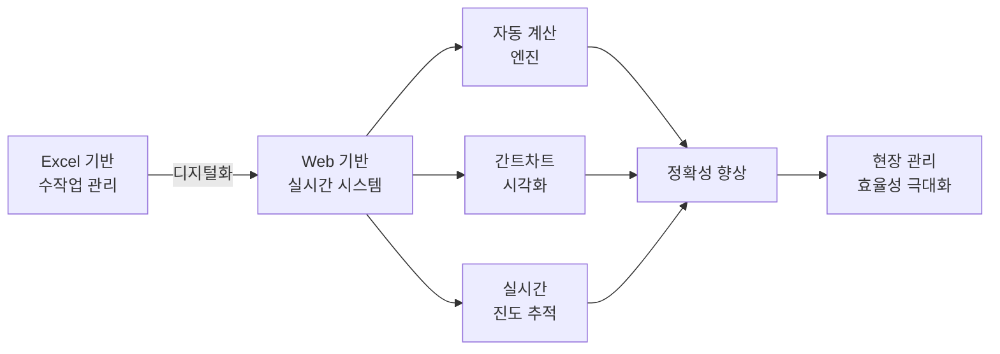

### 1.1.2 핵심 기능 요약
//**지하층은 동별 탭이아닌 타설구간 탭을 만들고 타설구간에 주동지하,지하주차장,6.5m이상 층고부분 등 세분화된 공정일정 수립 가능하도록**
//**CP타설구간 계산기능- 가설,흙막이,토공사일수+버림,기초,주동지하B2,주동지하B1 까지의 공사일수가 가장긴 구간을 CP로설정**
| 기능 영역 | 주요 기능 | 설명 |
|----------|----------|------|
| **공정 계획 수립** | 동별 공정계획표 | 6가지 공정 구분별 세부 일정 자동 계산 |
| | 지하층 공정계획표 | 가설/흙막이/토공 포함 지하 공정 관리 | 
| | 공정 타입 선택 | 표준공정, 5~8일 사이클 중 선택 |
| **자동 계산** | 물량 기반 일수 산정 | 동·층별 물량표와 연동하여 자동 계산 |
| | 인원/장비 산출 | 생산성 기준 필요 인원 및 장비 계산 |
| | 간접일 자동 반영 | 양생, 검측 등 간접 작업일 포함 |
| **시각화** | 간트차트 | 동별 공정을 타임라인으로 표시 |
| | 진도 히트맵 | 층별 공사 진행 상황 색상 표시 |
| | KPI 대시보드 | 주요 지표 실시간 모니터링 |
| **데이터 관리** | 프로젝트별 관리 | 여러 프로젝트 독립적 관리 |
| | 동별 데이터 분리 | 동마다 별도 공정계획 수립 |
| | 변경 이력 추적 | 수정 시점 및 내용 기록 |

### 1.1.3 시스템 범위 및 제약사항

#### 현재 버전 범위 (v1.0)

**포함 사항:**
- ✅ 골조 직영공사 공정계획 수립
- ✅ 6개 공정 구분 (버림→기초→지하층→셋팅층→기준층→옥탑층)
- ✅ 자동 일수 계산 및 인원 산출
- ✅ 브라우저 LocalStorage 기반 데이터 저장
- ✅ 반응형 UI (모바일/태블릿/데스크톱)

**제외 사항:**
- ❌ 마감공사 및 설비공사 (골조만 지원)
- ❌ 실시간 다중 사용자 협업 (단일 사용자)                //**초기버전부터 다중사용자 협업가능하게 해야함**   
- ❌ 서버 기반 데이터 동기화 (향후 Supabase 연동 예정)
- ❌ 자재 발주 및 원가 관리
- ❌ 인력 배치 최적화

#### 기술적 제약사항

| 제약 사항 | 설명 | 영향 |
|----------|------|------|
| **브라우저 의존성** | LocalStorage 사용으로 브라우저별 데이터 독립 | 동일 계정이라도 다른 브라우저에서는 데이터 미동기화 |
| **저장 용량 제한** | LocalStorage 5~10MB 제한 | 대규모 프로젝트(100동 이상) 시 용량 부족 가능 |
| **오프라인 모드** | 인터넷 연결 필수 (Next.js SSR) | 현장에서 네트워크 불안정 시 사용 제한 |
| **실시간 동기화** | 서버 DB 미연동 | 여러 관리자가 동시 작업 시 데이터 충돌 가능 |

#### 향후 확장 계획

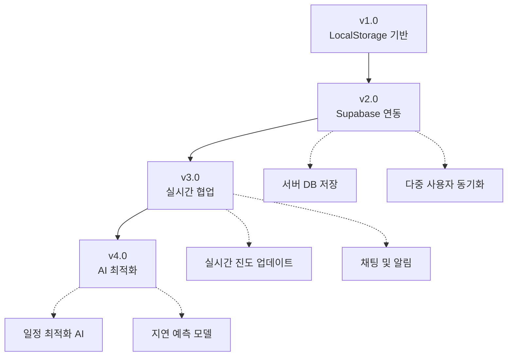

---

## 1.2 건축 공정관리 기본 개념

### 1.2.1 골조공사 프로세스

골조공사는 건물의 뼈대를 구성하는 공사로, 다음과 같은 순서로 진행됩니다:

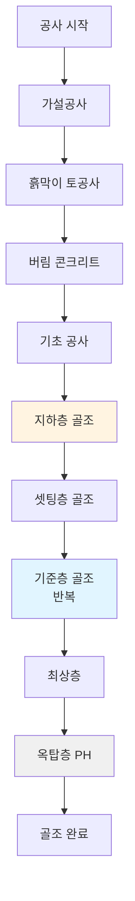

#### 공정별 설명

1. **가설공사**: 현장 사무소, 안전 시설물 설치
2. **흙막이·토공사**: 지하 굴착 및 흙막이 벽 시공
3. **버림 콘크리트**: 지반 평탄화 및 먹줄 작업용 바닥
4. **기초 공사**: 건물 하중을 지반에 전달하는 기초 구조물
5. **지하층 골조**: 지하 주차장 및 설비 공간 구조
6. **셋팅층 골조**: 1~5층 저층부 (지상층 첫 시공)
7. **기준층 골조**: 반복되는 중간층 (사이클 공정 적용)
8. **최상층**: 기준층과 구조가 다른 최상층
9. **옥탑층(PH)**: 계단실, 엘리베이터 기계실 등

### 1.2.2 공정 구분 체계

ConTech-DX는 골조공사를 **6가지 공정 구분(ProcessCategory)**으로 분류합니다:

| 순번 | 공정 구분 | 영문 코드 | 설명 | 특징 |
|-----|----------|----------|------|------|
| 1 | **버림** | Blinding | 버림 콘크리트 타설 | 단순, 1~2일 소요 |
| 2 | **기초** | Foundation | 기초 철근·거푸집·타설 | 고정 일정, 약 7~10일 |
| 3 | **지하층** | Basement | 지하 골조 전체 | B2→B1 순차, 복잡 |
| 4 | **셋팅층** | Setting Floor | 1~5층 저층부 | 기준층 시작 전 준비 |
| 5 | **기준층** | Standard Floor | 반복되는 중간층 | 사이클 공정 적용 |
| 6 | **옥탑층** | Penthouse (PH) | 옥탑 및 설비 공간 | 소규모, 단순 |

#### 공정 구분별 세부 작업

각 공정 구분은 다시 여러 **세부공정 항목(ProcessItem)**으로 구성됩니다:

**예시: 기초 공사 세부 항목**
1. 먹매김 (1일 고정)
2. 기초 철근 조립 (6일 고정)
3. 끊어치기 작업 (2일 고정)
4. 기초 타설 (물량에 따라 계산)
5. 양생 (3일 간접일)

### 1.2.3 사이클 공정의 개념

**기준층**은 같은 평면이 여러 층에 걸쳐 반복되므로, **사이클 공정**을 적용하여 효율적으로 관리합니다.

#### 사이클 공정이란?

한 층을 완료하는 데 필요한 일수를 **사이클**이라고 하며, 이 사이클을 반복하여 여러 층을 시공합니다.

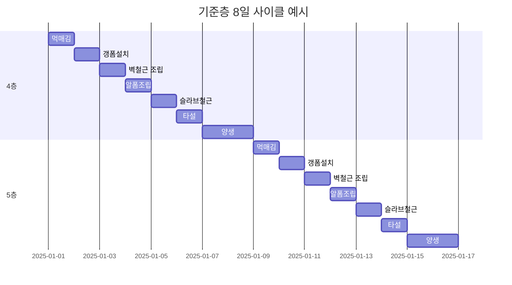

#### 사이클 종류

| 사이클 | 순작업일 | 양생일 | 총일수 | 특징 |
|-------|---------|--------|--------|------|
| **5일 사이클** | 3일 | 2일 | 5일 | 매우 빠른 시공, 인력 다수 투입 |
| **6일 사이클** | 4일 | 2일 | 6일 | 빠른 시공, 최적 인력 배치 |
| **7일 사이클** | 5일 | 2일 | 7일 | 표준 시공, 안정적 품질 |
| **8일 사이클** | 6일 | 2일 | 8일 | 여유 있는 시공, 높은 품질 |

**선택 기준:**
- 공사 기간이 촉박한 경우 → 5~6일 사이클
- 인력 확보가 어려운 경우 → 7~8일 사이클
- 품질 중시 프로젝트 → 8일 사이클
- 표준 아파트 현장 → 6~7일 사이클

### 1.2.4 건축 공정 용어 정의

#### 공정 관련 용어

| 용어 | 영문 | 설명 | 예시 |
|------|------|------|------|
| **먹매김** | Marking | 철근 및 거푸집 설치 위치를 바닥에 표시하는 작업 | 1일 소요 |
| **갱폼** | Gang Form | 벽체 거푸집의 일종으로 여러 장을 한 번에 설치 | 대형 패널 |
| **알폼** | Aluminium Form | 알루미늄 합금으로 만든 거푸집 (보·슬라브용) | 경량, 재사용 |
| **유로폼** | Euro Form | 유럽형 거푸집 시스템 (강재 프레임) | 옥탑층 주로 사용 |
| **타설** | Concrete Placing | 콘크리트를 거푸집에 부어넣는 작업 | 펌프카 사용 |
| **양생** | Curing | 콘크리트가 충분한 강도를 얻을 때까지 관리 | 최소 2~3일 |
| **검측** | Inspection | 철근 배근 상태를 감리자가 확인하는 절차 | 0.5일 소요 |
| **해체** | Stripping | 콘크리트가 굳은 후 거푸집을 제거하는 작업 | 양생 후 진행 |

#### 구조 관련 용어

| 용어 | 설명 | 비고 |
|------|------|------|
| **코어** | 엘리베이터, 계단실 등 수직 동선 공간 | 타워형은 2~4개 코어 |
| **셋팅층** | 기준층 반복 시공 전 1~5층 저층부 | 필로티, 상가 등 |
| **기준층** | 동일 평면이 반복되는 중간층 | 6~20층 등 |
| **최상층** | 기준층과 구조가 다른 맨 위층 | 지붕 슬라브 |
| **옥탑층(PH)** | Penthouse, 계단실·기계실 등 | 1~2개층 |
| **벽식구조** | 벽체로 하중을 지탱하는 구조 | 아파트 일반형 |
| **RC구조** | 기둥·보로 하중을 지탱하는 구조 | Reinforced Concrete |
| **필로티** | 1층 일부를 기둥만 남기고 개방 | 주차장, 통로 |

#### 물량 관련 용어

| 용어 | 단위 | 설명 |
|------|------|------|
| **형틀(거푸집)** | ㎡ | 콘크리트를 부어넣을 틀의 면적 |
| **갱폼** | ㎡ | 벽체용 대형 거푸집 면적 |
| **알폼** | ㎡ | 보·슬라브용 알루미늄 거푸집 면적 |
| **철근** | ton | 철근 총 중량 |
| **콘크리트** | ㎥ | 콘크리트 체적 (부피) |
| **타설량** | ㎥ | 1회 타설하는 콘크리트 양 |

#### 인력 관련 용어

| 용어 | 설명 |
|------|------|
| **1일 작업량** | 1명이 하루 동안 수행할 수 있는 작업량 (생산성) |
| **총 작업인원** | 전체 작업을 완료하기 위해 필요한 연인원 |
| **1일 투입인원** | 매일 현장에 투입되는 인원 수 |
| **순작업일** | 실제로 작업하는 일수 (간접일 제외) |
| **간접일** | 양생, 검측 등 직접 작업이 아닌 일수 |
| **총 작업일수** | 순작업일 + 간접일 |

#### 장비 관련 용어

| 용어 | 설명 |
|------|------|
| **콘크리트 펌프카** | 콘크리트를 높은 곳으로 펌핑하는 장비 |
| **타워크레인** | 자재를 수직으로 운반하는 크레인 |
| **대당 타설량** | 펌프카 1대가 1일 타설 가능한 콘크리트 양 |
| **장비 대수** | 투입되는 장비의 수 (펌프카 1대, 2대 등) |

---

### 1.2.5 공정계획 시스템 순서도

#### 전체 공정계획 수립 프로세스

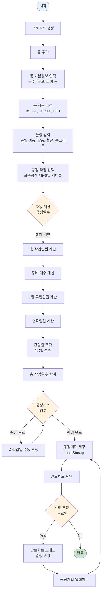

#### 공정 계산 로직 상세 순서도

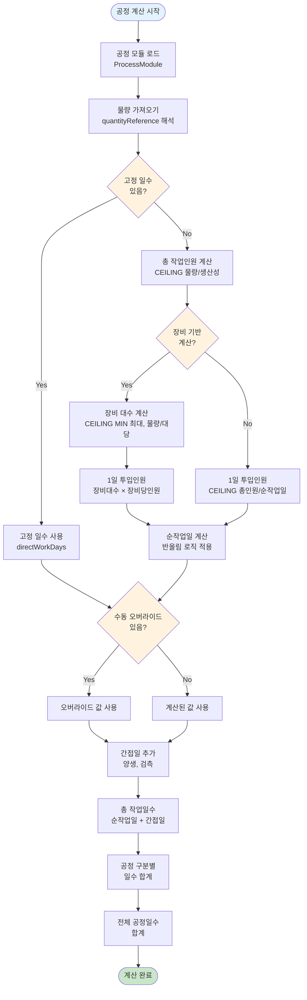

#### 데이터 저장/로드 흐름

```mermaid
flowchart TD
    Start([사용자 작업]) --> UserAction{사용자 액션}
    
    UserAction -->|공정계획 수정| UpdatePlan[공정계획 업데이트]
    UserAction -->|공정계획 조회| LoadPlan[공정계획 로드]
    
    UpdatePlan --> CheckCache{메모리 캐시<br/>존재?}
    CheckCache -->|Yes| UpdateCache[캐시 업데이트]
    CheckCache -->|No| CreateCache[캐시 생성]
    
    UpdateCache --> Serialize[데이터 직렬화<br/>JSON.stringify]
    CreateCache --> Serialize
    
    Serialize --> SaveLocalStorage[LocalStorage 저장<br/>key: contech_process_plan_{buildingId}]
    SaveLocalStorage --> SetTimestamp[타임스탬프 설정<br/>updatedAt]
    SetTimestamp --> NotifyUser[사용자 알림<br/>토스트 메시지]
    NotifyUser --> End1([저장 완료])
    
    LoadPlan --> CheckCache2{메모리 캐시<br/>존재?}
    CheckCache2 -->|Yes| CheckTTL{TTL 유효?<br/>5분}
    CheckCache2 -->|No| LoadFromStorage[LocalStorage 로드]
    
    CheckTTL -->|Yes| ReturnCache[캐시 반환]
    CheckTTL -->|No| LoadFromStorage
    
    LoadFromStorage --> ParseData[데이터 파싱<br/>JSON.parse]
    ParseData --> ValidateData{데이터<br/>유효성 검증}
    
    ValidateData -->|유효| UpdateCache2[캐시 업데이트]
    ValidateData -->|무효| CreateDefault[기본 공정계획 생성]
    
    UpdateCache2 --> ReturnData[데이터 반환]
    CreateDefault --> ReturnData
    ReturnCache --> ReturnData
    
    ReturnData --> End2([로드 완료])
    
    style Start fill:#e3f2fd
    style End1 fill:#c8e6c9
    style End2 fill:#c8e6c9
    style CheckCache fill:#fff3e0
    style CheckCache2 fill:#fff3e0
    style CheckTTL fill:#fff3e0
    style ValidateData fill:#fff3e0
```

#### 공정 구분별 처리 흐름

```mermaid
flowchart TD
    Start([공정계획 페이지 진입]) --> SelectBuilding[동 선택]
    SelectBuilding --> LoadPlan[공정계획 로드]
    LoadPlan --> LoopCategories{6개 공정 구분<br/>순회}
    
    LoopCategories -->|버림| ProcessBlinding[버림 처리]
    LoopCategories -->|기초| ProcessFoundation[기초 처리]
    LoopCategories -->|지하층| ProcessBasement[지하층 처리]
    LoopCategories -->|셋팅층| ProcessSetting[셋팅층 처리]
    LoopCategories -->|기준층| ProcessStandard[기준층 처리]
    LoopCategories -->|옥탑층| ProcessPH[옥탑층 처리]
    
    ProcessBlinding --> GetModule1[공정 모듈 로드<br/>blinding-standard]
    ProcessFoundation --> GetModule2[공정 모듈 로드<br/>foundation-standard]
    ProcessBasement --> GetModule3[공정 모듈 로드<br/>basement-standard]
    ProcessSetting --> GetModule4[공정 모듈 로드<br/>setting-{cycle}]
    ProcessStandard --> GetModule5[공정 모듈 로드<br/>standard-{cycle}]
    ProcessPH --> GetModule6[공정 모듈 로드<br/>ph-{cycle}]
    
    GetModule1 --> CalcItems1[세부공정 항목 계산<br/>2개 항목]
    GetModule2 --> CalcItems2[세부공정 항목 계산<br/>4개 항목]
    GetModule3 --> CalcItems3[세부공정 항목 계산<br/>15개 항목]
    GetModule4 --> CalcItems4[세부공정 항목 계산<br/>6개 항목]
    GetModule5 --> CalcItems5[세부공정 항목 계산<br/>6개 항목 × 층수]
    GetModule6 --> CalcItems6[세부공정 항목 계산<br/>5개 항목]
    
    CalcItems1 --> SumDays1[일수 합계]
    CalcItems2 --> SumDays2[일수 합계]
    CalcItems3 --> SumDays3[일수 합계]
    CalcItems4 --> SumDays4[일수 합계]
    CalcItems5 --> SumDays5[일수 합계]
    CalcItems6 --> SumDays6[일수 합계]
    
    SumDays1 --> CheckNext{다음 구분<br/>있음?}
    SumDays2 --> CheckNext
    SumDays3 --> CheckNext
    SumDays4 --> CheckNext
    SumDays5 --> CheckNext
    SumDays6 --> CheckNext
    
    CheckNext -->|Yes| LoopCategories
    CheckNext -->|No| SumTotal[전체 일수 합계<br/>버림+기초+지하층+셋팅층+기준층+옥탑층]
    
    SumTotal --> DisplayResult[결과 표시<br/>공정일수 요약]
    DisplayResult --> End([완료])
    
    style Start fill:#e3f2fd
    style End fill:#c8e6c9
    style LoopCategories fill:#fff3e0
    style CheckNext fill:#fff3e0
```

### 1.2.6 공정관리의 핵심 원칙

ConTech-DX 시스템은 다음과 같은 공정관리 원칙을 코드로 구현합니다:

#### 원칙 1: 순차 진행 (Sequential Flow)

```
버림 완료 → 기초 시작
기초 완료 → 지하층 시작
지하층 완료 → 셋팅층 시작
셋팅층 완료 → 기준층 시작
기준층 완료 → 옥탑층 시작
```

**시스템 반영**: 간트차트에서 자동으로 의존성(dependency) 설정

#### 원칙 2: 물량 기반 계산 (Quantity-Driven)

```
공정일수 = f(물량, 생산성, 인력, 장비)
```

**시스템 반영**: 동·층별 물량표와 연동하여 실시간 자동 계산

#### 원칙 3: 표준화 (Standardization)

- 공정 모듈 데이터: 업계 표준 생산성 적용
- 계산 수식: Excel 기반 검증된 공식 사용
- UI 패턴: 일관된 입력/출력 구조

#### 원칙 4: 유연성 (Flexibility)

- 공정 타입 변경 가능 (표준공정 ↔ 사이클 공정)
- 순작업일 수동 조정 가능
- 특수 상황 대응 (합벽, 일체타설 등)

---

이로써 1부 시스템 개요가 완료되었습니다. 다음 섹션에서는 시스템의 기술적 아키텍처를 상세히 다룹니다.

---

# 2부: 시스템 아키텍처

## 2.1 전체 시스템 구조

### 2.1.1 레이어별 아키텍처

ConTech-DX의 공정관리 시스템은 **4계층 아키텍처**로 설계되어 있습니다:

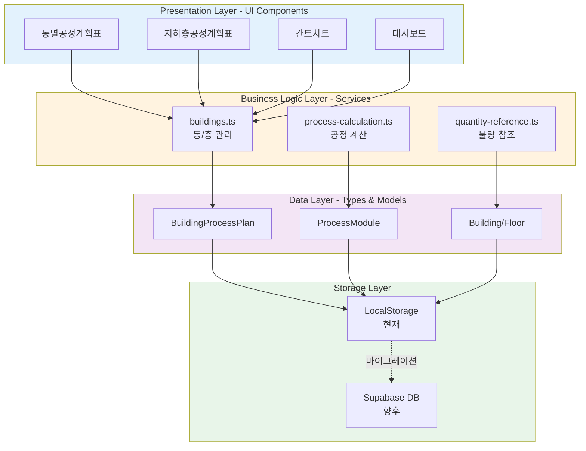

#### 계층별 책임

| 계층 | 책임 | 주요 기술 |
|------|------|----------|
| **Presentation** | 사용자 인터페이스, 입력 검증, 이벤트 처리 | React, TypeScript, Tailwind CSS |
| **Business Logic** | 공정 계산, 데이터 변환, 유효성 검증 | TypeScript Functions |
| **Data** | 타입 정의, 데이터 모델, 관계 설정 | TypeScript Types/Interfaces |
| **Storage** | 데이터 영속화, CRUD 연산 | LocalStorage (→ Supabase) |

### 2.1.2 데이터 흐름도

#### 공정계획 수립 흐름

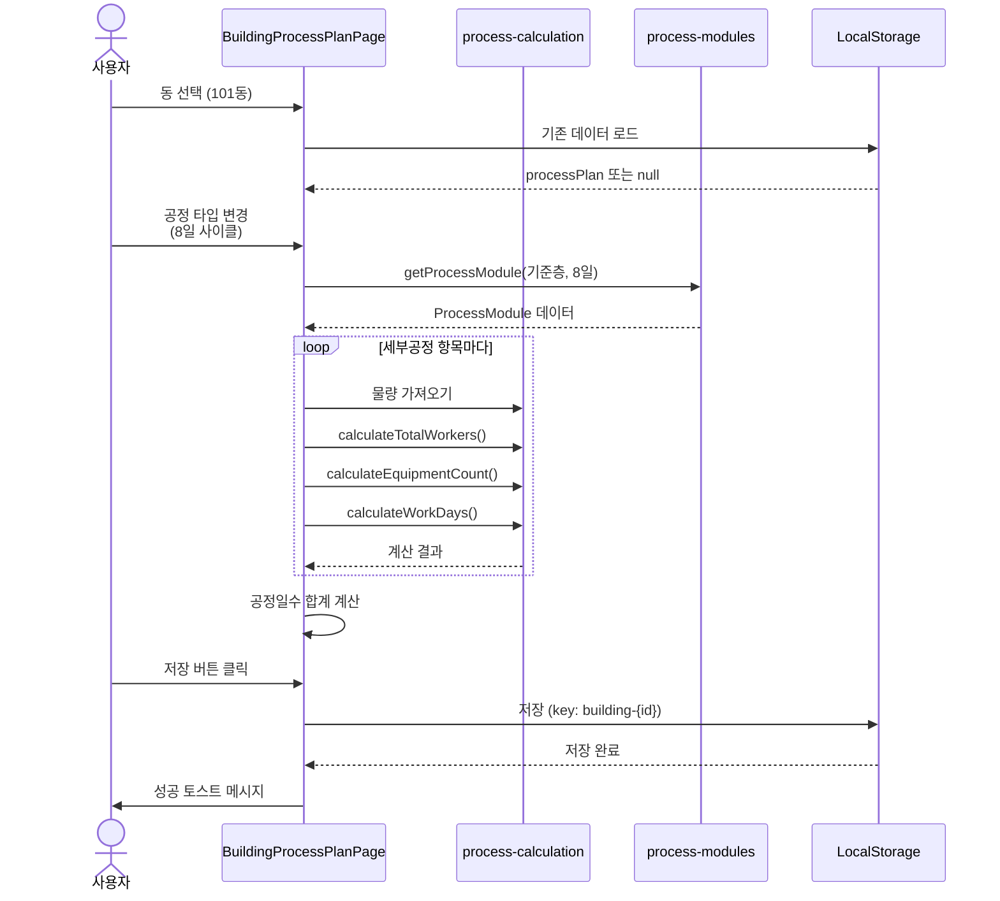

#### 간트차트 연동 흐름 (향후)

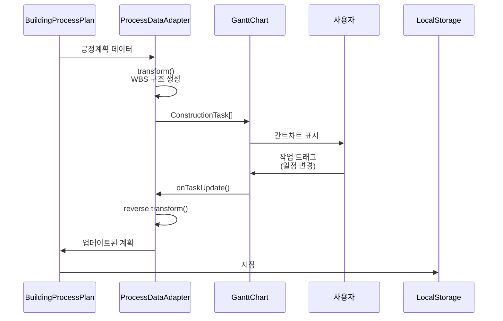

### 2.1.3 컴포넌트 의존성 맵

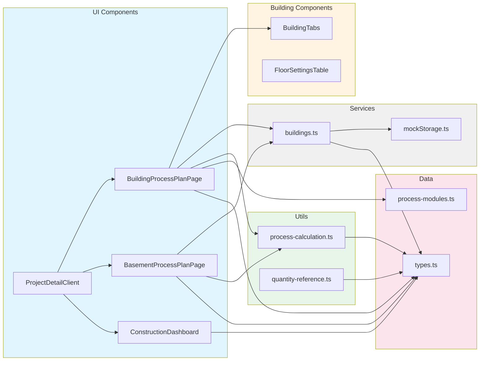

---

## 2.2 기술 스택

### 2.2.1 프론트엔드 기술

| 기술 | 버전 | 용도 | 선정 이유 |
|------|------|------|----------|
| **Next.js** | 15.x | React 프레임워크 | App Router, SSR, 최적화 |
| **React** | 19.x | UI 라이브러리 | 컴포넌트 기반, 생태계 |
| **TypeScript** | 5.x | 타입 안전성 | 대규모 프로젝트 안정성 |
| **Tailwind CSS** | 4.x | 스타일링 | 빠른 개발, 일관성 |
| **Framer Motion** | Latest | 애니메이션 | 부드러운 UI 전환 |
| **date-fns** | 4.x | 날짜 처리 | 경량, 트리셰이킹 |
| **Sonner** | Latest | 토스트 알림 | 깔끔한 UX |

### 2.2.2 상태 관리 전략

ConTech-DX는 **서버 상태**와 **클라이언트 상태**를 구분하여 관리합니다:

#### 클라이언트 상태 (React Hooks)

```typescript
// useState: 컴포넌트 로컬 상태
const [activeTab, setActiveTab] = useState<string>('overview');
const [isLoading, setIsLoading] = useState<boolean>(false);

// useMemo: 계산 결과 메모이제이션
const standardFloors = useMemo(() => {
  return building.floors.filter(f => f.floorClass === '기준층');
}, [building.floors]);

// useCallback: 함수 메모이제이션
const handleSave = useCallback(async () => {
  await savePlan(processPlan);
}, [processPlan]);

// useEffect: 사이드 이펙트 (데이터 로드)
useEffect(() => {
  loadProcessPlan(buildingId);
}, [buildingId]);
```

#### 서버 상태 (LocalStorage)

```typescript
// 공정계획 저장
const STORAGE_KEY = `contech_process_plan_${buildingId}`;
localStorage.setItem(STORAGE_KEY, JSON.stringify(processPlan));

// 공정계획 로드
const data = localStorage.getItem(STORAGE_KEY);
const processPlan = data ? JSON.parse(data) : null;

// 동 데이터 캐시 (TTL 5분)
const buildingsCache = new Map<string, CacheEntry<Building[]>>();
```

**향후 마이그레이션**: LocalStorage → Supabase PostgreSQL

### 2.2.3 향후 백엔드 (Supabase)

Supabase 마이그레이션 시 다음과 같은 구조로 전환됩니다:

```typescript
// Supabase 클라이언트
import { createClient } from '@/lib/supabase/client';

// 공정계획 저장 (INSERT/UPDATE)
async function saveBuildingProcessPlan(plan: BuildingProcessPlan) {
  const supabase = createClient();
  const { data, error } = await supabase
    .from('building_process_plans')
    .upsert(plan)
    .select()
    .single();
  
  if (error) throw error;
  return data;
}

// 공정계획 조회
async function getBuildingProcessPlan(buildingId: string) {
  const supabase = createClient();
  const { data, error } = await supabase
    .from('building_process_plans')
    .select('*')
    .eq('building_id', buildingId)
    .single();
  
  if (error && error.code !== 'PGRST116') throw error;
  return data;
}
```

**마이그레이션 계획 상세**: [`docs/SUPABASE_MIGRATION.md`](./SUPABASE_MIGRATION.md) 참조

---

## 2.3 디렉토리 구조

### 2.3.1 전체 구조 개요

```
src/
├── app/                          # Next.js App Router
│   └── (container)/
│       └── projects/
│           └── [id]/page.tsx     # 프로젝트 상세 (공정관리 진입점)
│
├── components/
│   ├── ui/                       # 재사용 가능한 UI 컴포넌트
│   │   ├── Button.tsx
│   │   ├── Card.tsx
│   │   ├── Input.tsx
│   │   └── ...
│   │
│   ├── buildings/                # 🏗️ 공정관리 핵심 컴포넌트
│   │   ├── BuildingProcessPlanPage.tsx      # 동별공정계획표
│   │   ├── BasementProcessPlanPage.tsx      # 지하층공정계획표
│   │   ├── BuildingTabs.tsx                 # 동 탭 네비게이션
│   │   ├── FloorSettingsTable.tsx           # 층 설정 테이블
│   │   └── ...
│   │
│   ├── dashboard/                # 대시보드 컴포넌트
│   │   ├── ConstructionDashboard.tsx
│   │   ├── TaktView.tsx
│   │   ├── BuildingProgress.tsx
│   │   └── KPICards.tsx
│   │
│   └── projects/                 # 프로젝트 관련 컴포넌트
│       ├── ProjectDetailClient.tsx
│       └── ProjectSidebar.tsx
│
├── lib/
│   ├── types.ts                  # 📘 타입 정의 (SSOT)
│   │
│   ├── data/                     # 🗂️ 정적 데이터
│   │   └── process-modules.ts   # 공정 모듈 데이터
│   │
│   ├── utils/                    # 🔧 유틸리티 함수
│   │   ├── process-calculation.ts    # 공정 계산 엔진
│   │   ├── quantity-reference.ts     # 물량 참조 시스템
│   │   ├── formatters.ts              # 날짜/통화 포맷
│   │   └── logger.ts                  # 로깅
│   │
│   ├── services/                 # 📦 비즈니스 로직
│   │   ├── buildings.ts          # 동/층 CRUD
│   │   ├── mockStorage.ts        # LocalStorage 관리
│   │   └── cache.ts              # TTL 캐시
│   │
│   └── supabase/                 # 🗄️ 데이터베이스 (향후)
│       ├── client.ts
│       └── server.ts
│
└── styles/
    └── globals.css               # 글로벌 스타일
```

### 2.3.2 핵심 파일 상세

#### 1. `src/components/buildings/BuildingProcessPlanPage.tsx`

**역할**: 동별 공정계획표 메인 컴포넌트

**주요 기능**:
- 동별 탭 네비게이션
- 6개 공정 구분 섹션 렌더링
- 공정 타입 선택 및 변경
- 세부공정 항목별 실시간 계산
- 순작업일 수동 오버라이드
- LocalStorage 저장/로드

**코드 구조**:
```typescript
// Props 정의
interface Props {
  projectId: string;
}

// 컴포넌트
export function BuildingProcessPlanPage({ projectId }: Props) {
  // 상태 관리
  const [buildings, setBuildings] = useState<Building[]>([]);
  const [processPlans, setProcessPlans] = useState<Map<string, BuildingProcessPlan>>(new Map());
  const [activeBuildingIndex, setActiveBuildingIndex] = useState(0);
  
  // 데이터 로드
  useEffect(() => {
    loadBuildings();
    loadProcessPlans();
  }, [projectId]);
  
  // 계산 로직
  const calculateProcessDays = (category: ProcessCategory) => {
    // ... 복잡한 계산 로직
  };
  
  // 렌더링
  return (
    <div>
      <BuildingTabs buildings={buildings} activeIndex={activeBuildingIndex} />
      {PROCESS_CATEGORIES.map(category => (
        <ProcessCategorySection key={category} category={category} />
      ))}
    </div>
  );
}
```

**파일 크기**: 약 2,900 라인 (대형 컴포넌트)

---

#### 2. `src/lib/data/process-modules.ts`

**역할**: 공정 모듈 정적 데이터 (엑셀 기반 표준 공정)

**데이터 구조**:
```typescript
export const PROCESS_MODULES: ProcessModule[] = [
  {
    id: 'blinding-standard',
    name: '표준공정',
    category: '버림',
    items: [
      {
        id: 'blinding-formwork',
        workItem: '1.버림틀설치',
        unit: '㎡',
        quantityReference: 'D6',
        dailyProductivity: 10,
        equipmentCount: 1,
        directWorkDays: 1,
        indirectDays: 0,
      },
      // ... 더 많은 항목
    ],
  },
  // ... 더 많은 모듈 (20개 이상)
];
```

**파일 크기**: 약 1,460 라인

---

#### 3. `src/lib/utils/process-calculation.ts`

**역할**: 공정 일수 계산 엔진

**주요 함수**:
```typescript
// 1. 총 작업인원 계산
export function calculateTotalWorkers(
  quantity: number, 
  dailyProductivity: number
): number {
  return Math.ceil(quantity / dailyProductivity);
}

// 2. 장비 대수 계산
export function calculateEquipmentCount(
  quantity: number,
  equipmentCalculationBase: number,
  maxCount: number = 2
): number {
  const ratio = quantity / equipmentCalculationBase;
  return Math.max(1, Math.ceil(Math.min(maxCount, ratio)));
}

// 3. 순작업일 계산 (반올림 로직)
export function calculateWorkDaysWithRounding(
  quantity: number,
  dailyProductivity: number,
  dailyInputWorkers: number
): number {
  const result = quantity / (dailyProductivity * dailyInputWorkers);
  const decimal = result - Math.floor(result);
  
  if (decimal < 0.5) {
    return Math.max(1, Math.floor(result));
  } else {
    return Math.max(1, Math.ceil(result));
  }
}

// 4. 총 작업일수 = 순작업일 + 간접일
export function calculateTotalWorkDays(
  directWorkDays: number, 
  indirectDays: number
): number {
  return Math.ceil(directWorkDays + indirectDays);
}
```

**파일 크기**: 약 125 라인

---

#### 4. `src/lib/services/buildings.ts`

**역할**: 동/층 데이터 관리 서비스

**주요 함수**:
```typescript
// 동 조회
export async function getBuildings(projectId: string): Promise<Building[]> {
  const buildings = await loadBuildingsWithCache(projectId);
  return [...buildings];
}

// 동 생성
export async function createBuilding(dto: CreateBuildingDTO): Promise<Building> {
  const newBuilding: Building = {
    id: generateId(),
    projectId: dto.projectId,
    buildingName: dto.buildingName,
    meta: dto.meta,
    floors: generateFloors(dto.meta.floorCount, dto.meta.coreCount, dto.meta.heights),
    floorTrades: [],
    createdAt: new Date().toISOString(),
    updatedAt: new Date().toISOString(),
  };
  
  await saveBuildings([...buildings, newBuilding]);
  return newBuilding;
}

// 동 수정
export async function updateBuilding(
  buildingId: string,
  projectId: string,
  updates: UpdateBuildingDTO
): Promise<Building> {
  // ... 복잡한 업데이트 로직
}

// 층 자동 생성
function generateFloors(
  floorCount: { basement: number; ground: number; ph: number },
  coreCount?: number,
  heights?: BuildingMeta['heights']
): Floor[] {
  // ... 지하층, 지상층, PH층 자동 생성
}
```

**파일 크기**: 약 1,010 라인

---

#### 5. `src/lib/types.ts`

**역할**: 타입 정의 (Single Source of Truth)

**주요 타입**:
```typescript
// 공정 구분
export type ProcessCategory = 
  | '버림' 
  | '기초' 
  | '지하층' 
  | '셋팅층' 
  | '기준층' 
  | '옥탑층';

// 공정 타입
export type ProcessType = 
  | '표준공정'
  | '5일 사이클'
  | '6일 사이클'
  | '7일 사이클'
  | '8일 사이클'
  | string;

// 동별 공정 계획
export interface BuildingProcessPlan {
  id: string;
  buildingId: string;
  projectId: string;
  processes: {
    [category in ProcessCategory]?: {
      days: number;
      processType: ProcessType;
      floors?: { [floorLabel: string]: { processType: ProcessType } };
    };
  };
  totalDays: number;
  itemDirectWorkDaysOverrides?: { [key: string]: number };
  temporaryWorkDays?: number;
  earthRetentionWorkDays?: number;
  earthworkWorkDays?: number;
  specialRowQuantities?: { [key: string]: any };
  createdAt?: string;
  updatedAt?: string;
}

// 동 정보
export interface Building {
  id: string;
  projectId: string;
  buildingName: string;
  buildingNumber: number;
  meta: BuildingMeta;
  floors: Floor[];
  floorTrades: FloorTrade[];
  createdAt: string;
  updatedAt: string;
}

// ... 더 많은 타입 (50개 이상)
```

**파일 크기**: 약 687 라인

---

### 2.3.3 Import 경로 규칙

ConTech-DX는 일관된 import 경로를 사용합니다:

```typescript
// ✅ 올바른 import 패턴

// 1. 타입 import (type-only)
import type { Building, ProcessCategory, ProcessType } from '@/lib/types';

// 2. UI 컴포넌트
import { Button, Card, Input } from '@/components/ui';

// 3. 서비스 함수
import { getBuildings, createBuilding } from '@/lib/services/buildings';

// 4. 유틸리티 함수
import { 
  calculateTotalWorkers, 
  calculateWorkDays 
} from '@/lib/utils/process-calculation';

// 5. 정적 데이터
import { PROCESS_MODULES, getProcessModule } from '@/lib/data/process-modules';

// 6. React 훅
import { useState, useEffect, useMemo, useCallback } from 'react';

// 7. Next.js 모듈
import Link from 'next/link';
import { useRouter } from 'next/navigation';

// 8. 외부 라이브러리
import { toast } from 'sonner';
```

**금지 패턴**:
```typescript
// ❌ 상대 경로 (깊이 2 이상)
import { Button } from '../../ui/Button';

// ❌ index.ts 명시
import { formatDate } from '@/lib/utils/index';
// ✅ 올바름
import { formatDate } from '@/lib/utils';

// ❌ default export와 named export 혼용
import ProcessModules from '@/lib/data/process-modules';
// ✅ 올바름 (모두 named export 사용)
import { PROCESS_MODULES } from '@/lib/data/process-modules';
```

---

### 2.3.4 코드 구조 원칙

#### 원칙 1: Single Responsibility

하나의 파일/함수는 하나의 책임만 갖습니다.

```typescript
// ✅ 좋은 예: 계산만 담당
export function calculateTotalWorkers(quantity: number, productivity: number) {
  return Math.ceil(quantity / productivity);
}

// ❌ 나쁜 예: 계산 + UI 업데이트
export function calculateAndUpdateWorkers(quantity: number, productivity: number) {
  const workers = Math.ceil(quantity / productivity);
  document.getElementById('workers').innerText = workers.toString(); // UI 조작
  return workers;
}
```

#### 원칙 2: 타입 안전성

모든 함수와 변수는 명시적 타입을 가집니다.

```typescript
// ✅ 좋은 예: 명시적 타입
export function calculateEquipmentCount(
  quantity: number,
  base: number,
  max: number = 2
): number {
  return Math.max(1, Math.ceil(Math.min(max, quantity / base)));
}

// ❌ 나쁜 예: any 사용
export function calculateEquipmentCount(quantity: any, base: any, max: any) {
  return Math.max(1, Math.ceil(Math.min(max, quantity / base)));
}
```

#### 원칙 3: 불변성 (Immutability)

데이터는 직접 변경하지 않고 새로운 객체를 생성합니다.

```typescript
// ✅ 좋은 예: 불변 업데이트
const updatedPlan = {
  ...processPlan,
  processes: {
    ...processPlan.processes,
    [category]: { days: newDays, processType },
  },
};

// ❌ 나쁜 예: 직접 변경
processPlan.processes[category].days = newDays;
```

---

이로써 2부 시스템 아키텍처가 완료되었습니다. 다음 섹션에서는 데이터 모델을 상세히 다룹니다.

---

# 3부: 데이터 모델

## 3.1 핵심 타입 정의

### 3.1.1 공정 관련 타입

#### ProcessCategory (공정 구분)

```typescript
export type ProcessCategory = 
  | '버림'      // Blinding - 버림 콘크리트
  | '기초'      // Foundation - 기초 공사
  | '지하층'    // Basement - 지하 골조
  | '셋팅층'    // Setting Floor - 1~5층 저층부
  | '기준층'    // Standard Floor - 반복되는 중간층
  | '옥탑층';   // Penthouse - PH층
```

**사용 예시**:
```typescript
const PROCESS_CATEGORIES: ProcessCategory[] = [
  '버림', '기초', '지하층', '셋팅층', '기준층', '옥탑층'
];

// 공정 구분별 데이터 접근
processPlan.processes['기준층']?.days;
```

---

#### ProcessType (공정 타입)

```typescript
export type ProcessType = 
  | '표준공정'       // Standard Process
  | '5일 사이클'     // 5-day Cycle
  | '6일 사이클'     // 6-day Cycle
  | '7일 사이클'     // 7-day Cycle
  | '8일 사이클'     // 8-day Cycle
  | '지하외벽 합벽 적용'  // 지하층 특수 케이스
  | '일체타설 적용'       // 지하층 특수 케이스
  | string;          // 커스텀 타입 허용
```

**공정 구분별 사용 가능한 타입**:

| 공정 구분 | 사용 가능한 ProcessType |
|----------|------------------------|
| 버림 | 표준공정 |
| 기초 | 표준공정 |
| 지하층 | 표준공정, 지하외벽 합벽 적용, 일체타설 적용 |
| 셋팅층 | 표준공정, 5~8일 사이클 |
| 기준층 | 5~8일 사이클 |
| 옥탑층 | 표준공정, 5~8일 사이클 |

---

#### BuildingProcessPlan (동별 공정 계획)

핵심 데이터 모델로, 한 동(Building)의 전체 공정 계획을 담습니다.

```typescript
export interface BuildingProcessPlan {
  // 식별자
  id: string;
  buildingId: string;
  projectId: string;
  
  // 구분별 공정 정보
  processes: {
    [category in ProcessCategory]?: {
      days: number;              // 공정일수 (간트차트 duration)
      processType: ProcessType;  // 선택된 공정 타입
      floors?: {                 // 층별 공정 타입 (선택)
        [floorLabel: string]: { 
          processType: ProcessType 
        }
      };
    };
  };
  
  // 전체 일정
  totalDays: number;  // 구분공정 합계일수 (버림+기초+지하층+...)
  
  // 세부공정 항목별 순작업일 오버라이드
  // 키: "category-floorLabel-itemId" 
  // 예: "기준층--standard-gangform"
  itemDirectWorkDaysOverrides?: { 
    [key: string]: number 
  };
  
  // 지하층 전용 필드
  temporaryWorkDays?: number;      // 가설공사 일수
  earthRetentionWorkDays?: number; // 흙막이 공사 일수
  earthworkWorkDays?: number;      // 토공사 일수
  
  // 주차장 및 3단 가시설 특수 물량 (지하층)
  // 키: "floorLabel-specialType" 
  // 예: "B1-parking", "B1-facility3"
  specialRowQuantities?: {
    [key: string]: {
      gangForm?: number;    // 갱폼 면적 (㎡)
      alForm?: number;      // 알폼 면적 (㎡)
      formwork?: number;    // 형틀 면적 (㎡)
      stripClean?: number;  // 해체정리 면적 (㎡)
      rebar?: number;       // 철근 중량 (ton)
      concrete?: number;    // 콘크리트 체적 (㎥)
    };
  };
  
  // 타임스탬프
  createdAt?: string;
  updatedAt?: string;
}
```

**사용 예시**:
```typescript
const processPlan: BuildingProcessPlan = {
  id: 'plan-101',
  buildingId: 'building-101',
  projectId: 'project-001',
  processes: {
    '버림': { days: 3, processType: '표준공정' },
    '기초': { days: 10, processType: '표준공정' },
    '지하층': { days: 45, processType: '표준공정' },
    '셋팅층': { days: 12, processType: '표준공정' },
    '기준층': { 
      days: 90, 
      processType: '6일 사이클',
      floors: {
        '4F': { processType: '7일 사이클' },  // 4층만 다른 사이클
      }
    },
    '옥탑층': { days: 15, processType: '표준공정' },
  },
  totalDays: 175,  // 3+10+45+12+90+15
  itemDirectWorkDaysOverrides: {
    '기준층--standard-gangform': 2,  // 갱폼설치 1일 → 2일로 변경
  },
  temporaryWorkDays: 7,
  earthRetentionWorkDays: 10,
  earthworkWorkDays: 15,
  createdAt: '2025-01-01T00:00:00Z',
  updatedAt: '2025-01-15T10:30:00Z',
};
```

---

#### ProcessModule (공정 모듈)

표준 공정 데이터를 담는 구조입니다. [`src/lib/data/process-modules.ts`](../src/lib/data/process-modules.ts)에 정의되어 있습니다.

```typescript
export interface ProcessModule {
  id: string;               // 모듈 고유 ID (예: 'blinding-standard')
  name: ProcessType;        // 공정 타입명 (예: '표준공정')
  category: ProcessCategory; // 공정 구분 (예: '버림')
  items: ProcessItem[];     // 세부공정 항목 목록
}
```

---

#### ProcessItem (세부공정 항목)

하나의 작업 항목을 나타냅니다 (예: "버림틀설치", "기초타설" 등).

```typescript
export interface ProcessItem {
  // 식별 정보
  id: string;                   // 항목 고유 ID
  workItem: string;             // 작업 항목명 (예: "1.버림틀설치")
  
  // 물량 정보
  unit: string;                 // 단위 (㎡, ㎥, TON 등)
  quantityReference?: string;   // 물량 참조 패턴 (예: "D6", "F7*0.45")
  
  // 생산성 정보
  dailyProductivity: number;    // 인당 1일 작업량
  calculationBasis?: string;    // 산정 기준 설명
  
  // 장비 정보
  equipmentName?: string;       // 투입장비명 (예: "콘크리트 펌프차")
  equipmentCount: number;       // 장비 대수 (고정값 또는 계산)
  equipmentCalculationBase?: number;  // 대당 타설량 (㎥)
  equipmentWorkersPerUnit?: number;   // 장비당 인원수 (4, 5, 6명 등)
  
  // 일수 정보
  directWorkDays?: number;      // 순작업일 (고정값인 경우)
  indirectDays: number;         // 간접일 (양생, 검측 등)
  indirectWorkItem?: string;    // 간접작업 내용
  
  // 층별 구분 (선택)
  floorLabel?: string;          // 층 라벨 (예: "B2", "B1", "1F")
}
```

**예시: 버림 콘크리트 타설 항목**
```typescript
const blindingConcreteItem: ProcessItem = {
  id: 'blinding-concrete',
  workItem: '2.버림타설',
  unit: '㎥',
  quantityReference: 'G6',  // 동,층별물량표 G6셀 참조
  dailyProductivity: 130,   // 1명당 1일 130㎥
  calculationBasis: '장비대수*4명 /버림부분',
  equipmentName: '콘크리트 펌프차',
  equipmentCount: 1,        // 계산식으로 결정됨
  equipmentCalculationBase: 650,  // 펌프카 1대당 650㎥
  equipmentWorkersPerUnit: 4,     // 펌프카 1대당 4명
  indirectDays: 1,
  indirectWorkItem: '양생',
  // directWorkDays는 계산으로 결정됨
};
```

---

### 3.1.2 동·층 관련 타입

#### Building (동 정보)

```typescript
export interface Building {
  // 식별자
  id: string;
  projectId: string;
  
  // 기본 정보
  buildingName: string;    // "101동"
  buildingNumber: number;  // 1, 2, 3, ...
  
  // 메타데이터 (층수, 층고, 코어 등)
  meta: BuildingMeta;
  
  // 관계 데이터
  floors: Floor[];         // 층 목록
  floorTrades: FloorTrade[];  // 층별 공종 데이터
  
  // 타임스탬프
  createdAt: string;
  updatedAt: string;
}
```

---

#### BuildingMeta (동 메타데이터)

```typescript
export interface BuildingMeta {
  // 기본 정보
  totalUnits: number;           // 총 세대수
  coreCount: number;            // 코어 개수 (1~4)
  coreType: CoreType;           // 중복도/타워형/편복도
  slabType: SlabType;           // 벽식/RC/벽식(내부기둥)
  
  // 층수 정보
  floorCount: {
    basement: number;         // 전체 지하층 수
    ground: number;           // 전체 지상층 수
    ph: number;               // 전체 옥탑층 수
    
    // 코어별 층수 (타워형)
    coreGroundFloors?: number[];     // [20, 25] → 코어1: 20층, 코어2: 25층
    coreBasementFloors?: number[];   // [2, 1] → 코어1: 지하2층, 코어2: 지하1층
    corePhFloors?: number[];         // [1, 2] → 코어1: PH1층, 코어2: PH2층
    
    // 필로티 정보
    pilotisCount?: number;            // 필로티 수량 (구버전 호환)
    corePilotisCounts?: number[];     // 코어별 필로티+부대시설 제외 세대수
    corePilotisHeights?: number[];    // 코어별 필로티 높이 (개층)
    
    hasHighCeilingEquipmentRoom?: boolean;  // 고천장 장비실 여부
  };
  
  // 층고 정보 (mm 단위)
  heights: {
    basement2: number;   // 지하2층 층고 (예: 3500)
    basement1: number;   // 지하1층 층고 (예: 3500)
    standard: number;    // 기준층 층고 (예: 2950)
    floor1: number;      // 1층 층고
    floor2: number;      // 2층 층고
    floor3: number;      // 3층 층고
    floor4?: number;     // 4층 층고 (선택)
    floor5?: number;     // 5층 층고 (선택)
    top: number;         // 최상층 층고
    ph: number | number[];  // PH층 층고 (단일 또는 배열)
  };
  
  // 공정 관련
  standardFloorCycle?: number;      // 기준층 공정사이클 (5~8일)
  pumpCarCount?: number | null;     // 펌프카 최대 투입대수
  
  // 잠금 상태
  isBasicInfoLocked?: boolean;      // 동기본정보 데이터 고정 여부
  isDataInputLocked?: boolean;      // 물량입력표 데이터 고정 여부
}
```

---

#### Floor (층 정보)

```typescript
export interface Floor {
  id: string;
  buildingId: string;
  
  floorLabel: string;     // "B2", "B1", "1F", "2~14F 기준층", "PH1"
  floorNumber: number;    // 정렬용 (-2, -1, 1, 2, ...)
  
  levelType: LevelType;   // '지하' | '지상'
  floorClass: FloorClass; // '지하층' | '셋팅층' | '기준층' | '최상층' | '옥탑층'
  
  height: number | null;  // 층고 (mm)
}

export type LevelType = '지하' | '지상';

export type FloorClass = 
  | '지하층'
  | '일반층'    // 1~5층 중 셋팅층 아닌 층
  | '셋팅층'    // 1~5층 중 기준층과 층고가 다른 층
  | '기준층'    // 반복되는 중간층
  | '최상층'    // 맨 위층
  | 'PH층'      // 옥탑층 (구버전 호환)
  | '옥탑층';   // 옥탑층
```

**사용 예시**:
```typescript
// 지하2층
const b2Floor: Floor = {
  id: 'floor-b2-001',
  buildingId: 'building-101',
  floorLabel: 'B2',
  floorNumber: -2,
  levelType: '지하',
  floorClass: '지하층',
  height: 3500,
};

// 기준층 범위 (6~14층)
const standardFloor: Floor = {
  id: 'floor-6-14-001',
  buildingId: 'building-101',
  floorLabel: '6~14F 기준층',
  floorNumber: 6,
  levelType: '지상',
  floorClass: '기준층',
  height: 2950,
};
```

---

#### FloorTrade (층별 공종 데이터)

```typescript
export interface FloorTrade {
  id: string;
  floorId: string;
  buildingId: string;
  tradeGroup: string;  // '골조' | '마감' | '설비' 등
  trades: TradeData;   // 공종별 상세 데이터
}

export interface TradeData {
  // 갱폼 (벽체용 대형 거푸집)
  gangForm?: {
    areaM2: number;       // 면적 (㎡)
    productivity: number; // 생산성
    workers: number;      // 인원
    cost: number;         // 단가
  };
  
  // 알폼 (보·슬라브용 알루미늄 거푸집)
  alForm?: {
    areaM2: number;
    productivity: number;
    workers: number;
    cost: number;
  };
  
  // 형틀 (일반 거푸집)
  formwork?: {
    areaM2: number;
    productivity: number;
    workers: number;
    cost: number;
  };
  
  // 해체/정리
  stripClean?: {
    areaM2: number;
    productivityM2: number;  // ㎡당 생산성
    workerDays: number;      // 인원일수
  };
  
  // 철근
  rebar?: {
    weightTon: number;        // 중량 (ton)
    productivityTon: number;  // ton당 생산성
    workerDays: number;
    costPerTon: number;       // ton당 단가
  };
  
  // 콘크리트
  concrete?: {
    volumeM3: number;         // 체적 (㎥)
    strength: string;         // 강도 (예: "24MPa")
    costPerM3: number;        // ㎥당 단가
  };
}
```

---

### 3.1.3 DTO (Data Transfer Object) 타입

#### CreateBuildingDTO

```typescript
export interface CreateBuildingDTO {
  projectId: string;
  buildingName: string;
  buildingNumber: number;
  meta: BuildingMeta;
}
```

#### UpdateBuildingDTO

```typescript
export interface UpdateBuildingDTO {
  buildingName?: string;
  meta?: Partial<BuildingMeta>;
}
```

#### CreateBuildingProcessPlanDTO

```typescript
export interface CreateBuildingProcessPlanDTO {
  buildingId: string;
  projectId: string;
  processes: {
    [category in ProcessCategory]?: {
      days?: number;
      processType: ProcessType;
    };
  };
}
```

---

## 3.2 데이터 관계도

### 3.2.1 ERD (Entity Relationship Diagram)

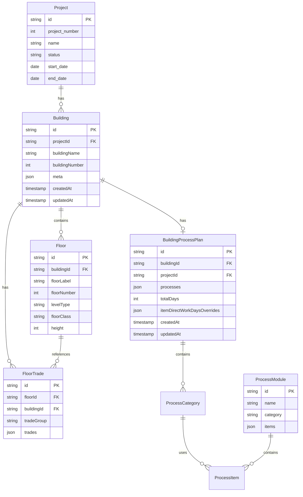

### 3.2.2 데이터 계층 구조

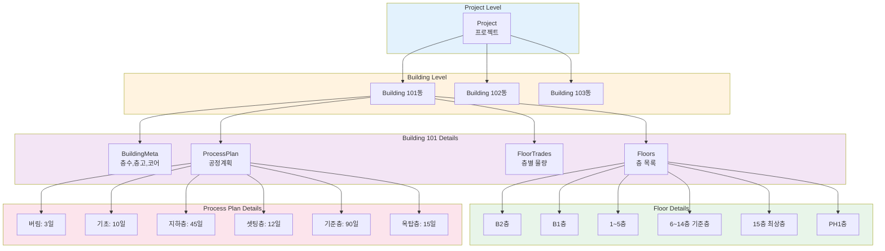

### 3.2.3 관계 설명

| 관계 | Cardinality | 설명 |
|------|-------------|------|
| Project → Building | 1:N | 하나의 프로젝트는 여러 동을 가짐 |
| Building → Floor | 1:N | 하나의 동은 여러 층을 가짐 |
| Building → FloorTrade | 1:N | 하나의 동은 여러 층별 공종 데이터를 가짐 |
| Building → BuildingProcessPlan | 1:1 | 하나의 동은 하나의 공정계획을 가짐 |
| Floor → FloorTrade | 1:N | 하나의 층은 여러 공종 데이터를 가짐 |
| ProcessModule → ProcessItem | 1:N | 하나의 공정 모듈은 여러 세부 항목을 가짐 |

---

## 3.3 저장소 전략

### 3.3.1 LocalStorage 키 패턴

ConTech-DX는 브라우저 LocalStorage를 사용하여 데이터를 저장합니다.

#### 키 명명 규칙

```typescript
// 패턴: contech_{데이터타입}_{식별자}

// 1. 동 데이터
const BUILDING_KEY = `contech_buildings_${projectId}`;
// 예: "contech_buildings_project-001"

// 2. 공정계획 데이터
const PROCESS_PLAN_KEY = `contech_process_plan_${buildingId}`;
// 예: "contech_process_plan_building-101"

// 3. 층 데이터
const FLOORS_KEY = `contech_floors_${buildingId}`;
// 예: "contech_floors_building-101"

// 4. 층별 공종 데이터
const FLOOR_TRADES_KEY = `contech_floor_trades_${buildingId}`;
// 예: "contech_floor_trades_building-101"
```

#### 저장/로드 함수

```typescript
// 저장
function saveBuildingProcessPlan(buildingId: string, plan: BuildingProcessPlan): void {
  const key = `contech_process_plan_${buildingId}`;
  const data = JSON.stringify(plan);
  localStorage.setItem(key, data);
}

// 로드
function loadBuildingProcessPlan(buildingId: string): BuildingProcessPlan | null {
  const key = `contech_process_plan_${buildingId}`;
  const data = localStorage.getItem(key);
  
  if (!data) return null;
  
  try {
    return JSON.parse(data) as BuildingProcessPlan;
  } catch (error) {
    console.error('Failed to parse process plan:', error);
    return null;
  }
}

// 삭제
function deleteBuildingProcessPlan(buildingId: string): void {
  const key = `contech_process_plan_${buildingId}`;
  localStorage.removeItem(key);
}
```

### 3.3.2 데이터 직렬화/역직렬화

#### Date 객체 처리

LocalStorage는 문자열만 저장할 수 있으므로, Date 객체는 ISO 8601 문자열로 변환합니다.

```typescript
// 저장 시
const plan: BuildingProcessPlan = {
  ...data,
  createdAt: new Date().toISOString(),  // "2025-01-15T10:30:00.000Z"
  updatedAt: new Date().toISOString(),
};

// 로드 시
const loaded = JSON.parse(data);
if (loaded.createdAt) {
  loaded.createdAt = new Date(loaded.createdAt);  // Date 객체로 변환
}
```

#### undefined vs null 처리

JSON.stringify는 undefined를 무시하므로, 명시적으로 null을 사용합니다.

```typescript
// ❌ 나쁜 예
const floor: Floor = {
  id: 'floor-1',
  buildingId: 'building-1',
  floorLabel: '1F',
  floorNumber: 1,
  levelType: '지상',
  floorClass: '셋팅층',
  height: undefined,  // JSON.stringify 시 제거됨
};

// ✅ 좋은 예
const floor: Floor = {
  id: 'floor-1',
  buildingId: 'building-1',
  floorLabel: '1F',
  floorNumber: 1,
  levelType: '지상',
  floorClass: '셋팅층',
  height: null,  // JSON.stringify 시 유지됨
};
```

### 3.3.3 TTL 기반 캐싱 전략

메모리 캐시를 사용하여 LocalStorage 접근을 최소화합니다.

#### 캐시 구조

```typescript
interface CacheEntry<T> {
  data: T;
  timestamp: number;
}

// TTL: 5분 (300,000ms)
const CACHE_TTL_MS = 5 * 60 * 1000;

// 캐시 맵
const buildingsCache = new Map<string, CacheEntry<Building[]>>();
```

#### 캐시 함수

```typescript
// 캐시 조회
function getCacheEntry(projectId: string): Building[] | null {
  const entry = buildingsCache.get(projectId);
  if (!entry) return null;
  
  const isExpired = Date.now() - entry.timestamp > CACHE_TTL_MS;
  if (isExpired) {
    buildingsCache.delete(projectId);
    return null;
  }
  
  return entry.data;
}

// 캐시 저장
function setCacheEntry(projectId: string, data: Building[]): void {
  buildingsCache.set(projectId, {
    data,
    timestamp: Date.now(),
  });
}

// 캐시 무효화
function invalidateCache(projectId: string): void {
  buildingsCache.delete(projectId);
}
```

#### 캐시 사용 흐름

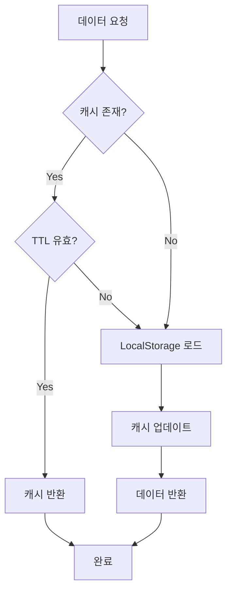

### 3.3.4 데이터 마이그레이션 준비

향후 Supabase DB로 마이그레이션 시를 대비한 인터페이스 설계:

```typescript
// 추상 인터페이스
interface IProcessPlanRepository {
  get(buildingId: string): Promise<BuildingProcessPlan | null>;
  save(plan: BuildingProcessPlan): Promise<void>;
  delete(buildingId: string): Promise<void>;
}

// LocalStorage 구현
class LocalStorageProcessPlanRepository implements IProcessPlanRepository {
  async get(buildingId: string): Promise<BuildingProcessPlan | null> {
    const key = `contech_process_plan_${buildingId}`;
    const data = localStorage.getItem(key);
    return data ? JSON.parse(data) : null;
  }
  
  async save(plan: BuildingProcessPlan): Promise<void> {
    const key = `contech_process_plan_${plan.buildingId}`;
    localStorage.setItem(key, JSON.stringify(plan));
  }
  
  async delete(buildingId: string): Promise<void> {
    const key = `contech_process_plan_${buildingId}`;
    localStorage.removeItem(key);
  }
}

// Supabase 구현 (향후)
class SupabaseProcessPlanRepository implements IProcessPlanRepository {
  async get(buildingId: string): Promise<BuildingProcessPlan | null> {
    const { data, error } = await supabase
      .from('building_process_plans')
      .select('*')
      .eq('building_id', buildingId)
      .single();
    
    if (error) return null;
    return data;
  }
  
  async save(plan: BuildingProcessPlan): Promise<void> {
    await supabase
      .from('building_process_plans')
      .upsert(plan);
  }
  
  async delete(buildingId: string): Promise<void> {
    await supabase
      .from('building_process_plans')
      .delete()
      .eq('building_id', buildingId);
  }
}
```

---

이로써 3부 데이터 모델이 완료되었습니다. 다음 섹션에서는 공정 계산 로직을 상세히 다룹니다.

---

# 4부: 공정 계산 로직

## 4.1 계산 알고리즘

### 4.1.1 계산 흐름 개요

공정 일수 계산은 다음과 같은 단계로 진행됩니다:

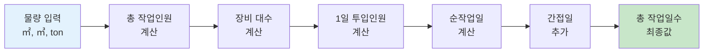

### 4.1.2 물량 → 인원 → 일수 계산

#### 단계 1: 총 작업인원 계산

**수식**: 총 작업인원 = CEILING(물량 / 인당 1일 작업량)

**함수**:
```typescript
export function calculateTotalWorkers(
  quantity: number,           // 물량
  dailyProductivity: number   // 인당 1일 작업량
): number {
  if (dailyProductivity === 0) return 0;
  return Math.ceil(quantity / dailyProductivity);
}
```

**예시**:
```typescript
// 철근 배근: 물량 30 ton, 생산성 0.8 ton/인/일
const totalWorkers = calculateTotalWorkers(30, 0.8);
// = CEILING(30 / 0.8)
// = CEILING(37.5)
// = 38명
```

---

#### 단계 2: 장비 대수 계산

**수식**: 장비 대수 = CEILING(MIN(최대 대수, 물량 / 대당 작업량), 1)

**함수**:
```typescript
export function calculateEquipmentCount(
  quantity: number,               // 물량 (㎥)
  equipmentCalculationBase: number, // 대당 타설량 (㎥)
  maxCount: number = 2            // 최대 장비 대수
): number {
  if (equipmentCalculationBase === 0) return 1;
  const ratio = quantity / equipmentCalculationBase;
  return Math.max(1, Math.ceil(Math.min(maxCount, ratio)));
}
```

**예시**:
```typescript
// 콘크리트 타설: 물량 800㎥, 펌프카 1대당 650㎥, 최대 2대
const equipmentCount = calculateEquipmentCount(800, 650, 2);
// = CEILING(MIN(2, 800/650), 1)
// = CEILING(MIN(2, 1.23), 1)
// = CEILING(1.23, 1)
// = 2대
```

**장비대수별 작업 구분**:
| 물량 (㎥) | 장비 대수 | 비고 |
|----------|----------|------|
| 0 ~ 650 | 1대 | 단일 장비 |
| 651 ~ 1,300 | 2대 | 2대 동시 투입 |
| 1,301 이상 | 2대 (최대) | 2일 이상 분할 타설 |

---

#### 단계 3: 1일 투입인원 계산

**방법 A: 장비 기반 계산** (타설 작업)

**수식**: 1일 투입인원 = 장비 대수 × 장비당 인원수

**함수**:
```typescript
export function calculateDailyInputWorkersByEquipment(
  equipmentCount: number,       // 장비 대수
  workersPerUnit: number        // 장비당 인원수
): number {
  return equipmentCount * workersPerUnit;
}
```

**예시**:
```typescript
// 콘크리트 펌프카 2대, 대당 6명
const dailyWorkers = calculateDailyInputWorkersByEquipment(2, 6);
// = 2 × 6
// = 12명
```

**방법 B: 작업일 기반 계산** (일반 작업)

**수식**: 1일 투입인원 = CEILING(총 작업인원 / 순작업일)

**함수**:
```typescript
export function calculateDailyInputWorkersByWorkDays(
  totalWorkers: number,     // 총 작업인원
  directWorkDays: number    // 순작업일
): number {
  if (directWorkDays === 0) return 0;
  return Math.ceil(totalWorkers / directWorkDays);
}
```

**예시**:
```typescript
// 철근 배근: 총 38명, 순작업일 5일
const dailyWorkers = calculateDailyInputWorkersByWorkDays(38, 5);
// = CEILING(38 / 5)
// = CEILING(7.6)
// = 8명/일
```

---

#### 단계 4: 순작업일 계산 (복잡한 반올림 로직)

**수식**: 
```
result = 물량 / (인당 작업량 × 1일 투입인원)
if (result의 소수점 < 0.5) → ROUNDDOWN
else → ROUNDUP
최소값 = 1일
```

**함수**:
```typescript
export function calculateWorkDaysWithRounding(
  quantity: number,           // 물량
  dailyProductivity: number,  // 인당 1일 작업량
  dailyInputWorkers: number   // 1일 투입인원
): number {
  if (dailyProductivity === 0 || dailyInputWorkers === 0) return 1;
  
  const result = quantity / (dailyProductivity * dailyInputWorkers);
  const decimal = result - Math.floor(result);
  
  if (decimal < 0.5) {
    return Math.max(1, Math.floor(result));  // 내림
  } else {
    return Math.max(1, Math.ceil(result));   // 올림
  }
}
```

**예시**:
```typescript
// 케이스 1: 소수점 < 0.5 (내림)
// 물량 100㎡, 생산성 10㎡/인/일, 투입 8명/일
const days1 = calculateWorkDaysWithRounding(100, 10, 8);
// = 100 / (10 × 8) = 1.25
// 소수점 0.25 < 0.5 → 내림
// = 1일

// 케이스 2: 소수점 >= 0.5 (올림)
// 물량 150㎡, 생산성 10㎡/인/일, 투입 8명/일
const days2 = calculateWorkDaysWithRounding(150, 10, 8);
// = 150 / (10 × 8) = 1.875
// 소수점 0.875 >= 0.5 → 올림
// = 2일
```

**Excel 수식 호환**:
```excel
=MAX(1, IF(MOD(E/F/G, 1) < 0.5, ROUNDDOWN(E/F/G, 0), ROUNDUP(E/F/G, 0)))
```

---

#### 단계 5: 총 작업일수 계산

**수식**: 총 작업일수 = 순작업일 + 간접일

**함수**:
```typescript
export function calculateTotalWorkDays(
  directWorkDays: number,  // 순작업일
  indirectDays: number     // 간접일 (양생, 검측 등)
): number {
  return Math.ceil(directWorkDays + indirectDays);
}
```

**예시**:
```typescript
// 콘크리트 타설: 순작업일 1일, 양생 2일
const totalDays = calculateTotalWorkDays(1, 2);
// = 1 + 2
// = 3일
```

---

### 4.1.3 특수 케이스 처리

#### 케이스 A: 일수 고정 항목

먹매김, 검측 등 일부 항목은 물량과 무관하게 **고정 일수**를 사용합니다.

```typescript
// 먹매김: 항상 1일
const meokmaekim: ProcessItem = {
  id: 'meokmaekim',
  workItem: '1.먹매김(1일)',
  unit: '',
  dailyProductivity: 0,  // 생산성 미사용
  equipmentCount: 1,
  directWorkDays: 1,     // 고정값
  indirectDays: 0,
};

// 계산 로직
if (item.directWorkDays !== undefined && item.directWorkDays !== null) {
  // 고정 일수 사용
  순작업일 = item.directWorkDays;
} else {
  // 계산식 사용
  순작업일 = calculateWorkDaysWithRounding(...);
}
```

#### 케이스 B: 거푸집 해체정리

해체정리는 **간접일로만 분류**되며, 순작업일은 0입니다.

```typescript
const stripClean: ProcessItem = {
  id: 'basement-stripclean-b2',
  workItem: '*거푸집해체정리',
  unit: '㎡',
  quantityReference: 'D8',    // 해당 층의 형틀 수량
  dailyProductivity: 50,      // 50㎡/인/일
  directWorkDays: 0,          // 순작업일 0
  indirectDays: 16,           // 간접일로 분류
};

// 총 작업일수 = 0 + 16 = 16일
```

#### 케이스 C: 층별 다른 공정 타입

기준층에서 일부 층만 다른 사이클을 적용할 수 있습니다.

```typescript
const processPlan: BuildingProcessPlan = {
  processes: {
    '기준층': {
      days: 90,
      processType: '6일 사이클',  // 기본값
      floors: {
        '4F': { processType: '7일 사이클' },  // 4층만 7일
        '10F': { processType: '8일 사이클' }, // 10층만 8일
      }
    }
  }
};

// 계산 시 층별로 다른 모듈 데이터 사용
const module4F = getProcessModule('기준층', '7일 사이클');
const module10F = getProcessModule('기준층', '8일 사이클');
```

---

### 4.1.4 계산 예시: 기초 공사

**입력 데이터**:
- 기초 형틀: 500 ㎡
- 기초 철근: 50 ton
- 기초 콘크리트: 300 ㎥

**계산 과정**:

#### 항목 1: 먹매김

```
✅ 고정 일수
순작업일 = 1일
간접일 = 0일
총 작업일수 = 1일
```

#### 항목 2: 기초 철근 조립

```
물량 = 50 ton
생산성 = 1.1 ton/인/일
고정 일수 = 6일

✅ 고정 일수 사용
순작업일 = 6일
간접일 = 0.5일 (검측)
총 작업일수 = 6.5일 → 7일
```

#### 항목 3: 끊어치기 작업

```
물량 = 500 ㎡
생산성 = 10 ㎡/인/일
고정 일수 = 2일

✅ 고정 일수 사용
순작업일 = 2일
간접일 = 0.5일 (검측)
총 작업일수 = 2.5일 → 3일
```

#### 항목 4: 기초 타설

```
물량 = 300 ㎥
대당 타설량 = 650 ㎥
최대 장비 = 2대

장비 대수 = CEILING(MIN(2, 300/650), 1)
          = CEILING(MIN(2, 0.46), 1)
          = 1대

1일 투입인원 = 1대 × 5명/대
             = 5명

생산성 = 130 ㎥/인/일 (펌프카 작업은 이 값 사용 안 함)
실제 타설량 = 물량 / 장비대수
            = 300 / 1
            = 300 ㎥/일

순작업일 = CEILING(300 / (1대 × 650))
         = CEILING(0.46)
         = 1일

간접일 = 3일 (양생)

총 작업일수 = 1 + 3 = 4일
```

**기초 공사 총일수**: 1 + 7 + 3 + 4 = **15일**

---

## 4.2 공정 모듈 데이터

### 4.2.1 데이터 구조

공정 모듈 데이터는 [`src/lib/data/process-modules.ts`](../src/lib/data/process-modules.ts)에 정의되어 있으며, 총 **20개 이상의 모듈**을 포함합니다.

#### 모듈 목록

| 구분 | 공정 타입 | 모듈 ID | 항목 수 |
|------|----------|---------|---------|
| 버림 | 표준공정 | `blinding-standard` | 2개 |
| 기초 | 표준공정 | `foundation-standard` | 4개 |
| 지하층 | 표준공정 | `basement-standard` | 15개 |
| 셋팅층 | 표준공정 | `setting-standard` | 6개 |
| 셋팅층 | 5일 사이클 | `setting-5day` | 6개 |
| 셋팅층 | 6일 사이클 | `setting-6day` | 6개 |
| 셋팅층 | 7일 사이클 | `setting-7day` | 6개 |
| 셋팅층 | 8일 사이클 | `setting-8day` | 6개 |
| 기준층 | 5일 사이클 | `standard-5day` | 6개 |
| 기준층 | 6일 사이클 | `standard-6day` | 6개 |
| 기준층 | 7일 사이클 | `standard-7day` | 6개 |
| 기준층 | 8일 사이클 | `standard-8day` | 6개 |
| 옥탑층 | 표준공정 | `ph-standard` | 5개 |
| PH층 | 5일 사이클 | `ph-5day` | 5개 |
| PH층 | 6일 사이클 | `ph-6day` | 5개 |
| PH층 | 7일 사이클 | `ph-7day` | 5개 |
| PH층 | 8일 사이클 | `ph-8day` | 5개 |

### 4.2.2 버림 - 표준공정 상세

```typescript
{
  id: 'blinding-standard',
  name: '표준공정',
  category: '버림',
  items: [
    // 항목 1: 버림틀 설치
    {
      id: 'blinding-formwork',
      workItem: '1.버림틀설치',
      unit: '㎡',
      quantityReference: 'D6',      // 동,층별물량표!D6 (형틀)
      dailyProductivity: 10,        // 10㎡/인/일
      calculationBasis: '일수고정',
      equipmentCount: 1,
      directWorkDays: 1,            // 고정 1일
      indirectDays: 0,
    },
    
    // 항목 2: 버림 타설
    {
      id: 'blinding-concrete',
      workItem: '2.버림타설',
      unit: '㎥',
      quantityReference: 'G6',      // 동,층별물량표!G6 (콘크리트)
      dailyProductivity: 130,       // 130㎥/인/일
      calculationBasis: '장비대수*4명 /버림부분',
      equipmentName: '콘크리트 펌프차',
      equipmentCount: 1,            // 계산: CEILING(MIN(2, 물량/650), 1)
      equipmentCalculationBase: 650,  // 펌프카 1대당 650㎥
      equipmentWorkersPerUnit: 4,   // 펌프카 1대당 4명
      indirectDays: 1,
      indirectWorkItem: '양생',
      // directWorkDays는 계산으로 결정
    },
  ],
}
```

**특징**:
- 매우 단순한 공정 (2개 항목)
- 총 소요 일수: 약 2~3일
- 먹매김 작업 없음 (지반에 바로 시공)

### 4.2.3 기준층 - 6일 사이클 상세

```typescript
{
  id: 'standard-6day',
  name: '6일 사이클',
  category: '기준층',
  items: [
    // 항목 1: 먹매김
    {
      id: 'standard-meokmaekim-6day',
      workItem: '1.먹매김(1일)',
      calculationBasis: '일수고정',
      unit: '',
      equipmentCount: 1,
      directWorkDays: 1,        // 고정 1일
      dailyProductivity: 0,
      indirectDays: 0,
      indirectWorkItem: '검측',
    },
    
    // 항목 2: 갱폼 설치
    {
      id: 'standard-gangform-6day',
      workItem: '2.갱폼설치',
      unit: '㎡',
      quantityReference: 'B14',  // 동,층별물량표!B14 (갱폼)
      dailyProductivity: 60,     // 60㎡/인/일
      calculationBasis: '일수고정',
      equipmentCount: 1,
      directWorkDays: 1,         // 고정 1일
      indirectDays: 1,
      indirectWorkItem: '보강/검측',
    },
    
    // 항목 3: 옹벽 철근 조립
    {
      id: 'standard-wall-rebar-6day',
      workItem: '3.옹벽철근 조립',
      unit: 'ton',
      quantityReference: 'F14*0.5',  // 철근의 50% (벽체 부분)
      dailyProductivity: 0.8,        // 0.8ton/인/일
      calculationBasis: '일수고정',
      equipmentCount: 1,
      directWorkDays: 1,             // 고정 1일
      indirectDays: 0.5,
      indirectWorkItem: '검측',
    },
    
    // 항목 4: 알폼 조립
    {
      id: 'standard-alform-6day',
      workItem: '4.알폼조립',
      unit: '㎡',
      quantityReference: 'C14*0.55',  // 알폼의 55% (보·슬라브)
      dailyProductivity: 60,          // 60㎡/인/일
      calculationBasis: '일수고정',
      equipmentCount: 1,
      directWorkDays: 1,              // 고정 1일
      indirectDays: 0.5,
      indirectWorkItem: '검측',
    },
    
    // 항목 5: 슬라브 철근 조립
    {
      id: 'standard-slab-rebar-6day',
      workItem: '5.슬라브철근 조립',
      unit: 'ton',
      quantityReference: 'F14*0.5',   // 철근의 50% (슬라브 부분)
      dailyProductivity: 0.9,         // 0.9ton/인/일
      calculationBasis: '일수고정',
      equipmentCount: 1,
      directWorkDays: 1,              // 고정 1일
      indirectDays: 0.5,
      indirectWorkItem: '검측',
    },
    
    // 항목 6: 타설
    {
      id: 'standard-concrete-6day',
      workItem: '6.타설',
      unit: '㎥',
      quantityReference: 'G14',       // 콘크리트 전체
      dailyProductivity: 130,         // 130㎥/인/일
      calculationBasis: '장비대수*6명 /일반층',
      equipmentName: '콘크리트 펌프차',
      equipmentCount: 1,              // 계산: CEILING(MIN(2, 물량/320), 1)
      equipmentCalculationBase: 320,  // 기준층 대당 320㎥
      equipmentWorkersPerUnit: 6,     // 펌프카 1대당 6명
      indirectDays: 2,
      indirectWorkItem: '양생',
      // directWorkDays는 계산으로 결정
    },
  ],
}
```

**6일 사이클 일정**:
```
1일차: 먹매김
2일차: 갱폼설치 + 보강/검측 (1일 + 1일 = 2일차 완료)
3일차: 옹벽철근 조립 + 검측 (1일 + 0.5일 = 3일차 완료)
4일차: 알폼조립 + 검측 (1일 + 0.5일 = 4일차 완료)
5일차: 슬라브철근 조립 + 검측 (1일 + 0.5일 = 5일차 완료)
6일차: 타설 (1일)
7~8일차: 양생 (2일)
```

실제로는 일부 작업이 **병렬 진행**되어 6일에 완료됩니다.

### 4.2.4 5~8일 사이클 비교

| 항목 | 5일 | 6일 | 7일 | 8일 |
|------|-----|-----|-----|-----|
| **먹매김** | 1일 | 1일 | 1일 | 1일 |
| **갱폼설치** | 1일 | 1일 | 1일 | 1일 |
| **벽철근** | 1일 | 1일 | 1일 | 1일 |
| **알폼조립** | 1일 | 1일 | 1일 | 1일 |
| **슬라브철근** | 1일 | 1일 | 1일 | 1일 |
| **타설** | 1일 | 1일 | 1일 | 1일 |
| **양생** | 2일 | 2일 | 2일 | 2일 |
| **순작업일** | 3일 | 4일 | 5일 | 6일 |
| **총일수** | **5일** | **6일** | **7일** | **8일** |

**차이점**: 사이클이 길수록 인력을 **분산 투입**하여 일정에 여유를 둡니다.

### 4.2.5 지하층 - 표준공정 특징

지하층은 **가장 복잡한 공정**으로, 다음 특징이 있습니다:

1. **층별 분리**: B2층과 B1층을 별도 처리
2. **합벽 타설**: 벽과 슬라브를 2회로 나누어 타설
3. **거푸집 해체정리**: 별도 항목으로 관리 (간접일 16~22일)
4. **가설/흙막이/토공**: 별도 입력 필드

**B2층 항목 예시**:
```
1. 먹매김 (1일)
2. 옹벽철근조립 (5일 + 검측 0.5일)
3. 지하2층 거푸집설치 (17일 + 보강/검측 1일)
4. 보슬라브철근조립 (5일 + 검측 0.5일)
5. 마감작업 (2일 + 검측 0.5일)
6. 타설 (1일 + 양생 3일)
*. 거푸집해체정리 (간접일 16일)
```

**B1층 항목 예시** (2차 마감 및 타설 포함):
```
7. 먹매김 (1일)
8. 벽 철근조립 (5일 + 검측 0.5일)
9. 지하1층 거푸집 설치 (19일 + 검측 0.5일)
10. 보슬라브 철근조립 (5일 + 검측 0.5일)
11. 1차 마감작업 (2일 + 검측 0.5일)
12. 1차 타설 (1일 + 양생 3일)  // 벽체만
13. 2차 마감작업 (2일 + 검측 0.5일)
14. 2차 타설 (1일 + 양생 3일)  // 슬라브
*. 거푸집해체정리 (간접일 22일)
```

---

## 4.3 물량 참조 시스템

### 4.3.1 물량 참조 패턴

`quantityReference` 필드는 물량표의 셀을 참조하여 자동으로 물량을 가져옵니다.

#### 패턴 종류

| 패턴 | 설명 | 예시 |
|------|------|------|
| **단순 셀 참조** | 특정 셀 값 그대로 사용 | `"D6"` → 동,층별물량표!D6 |
| **수식 참조** | 셀 값에 계산 적용 | `"F7*0.45"` → F7 × 0.45 |
| **복합 참조** | 여러 셀 조합 | `"D8*0.95"` → D8 × 0.95 |

#### 물량표 셀 구조

**동,층별물량표** (가상 예시):

| 행 | A | B | C | D | E | F | G |
|----|---|---|---|---|---|---|---|
| **6** | 버림 | - | - | **형틀 200㎡** | - | - | **콘 80㎥** |
| **7** | 기초 | - | - | **형틀 500㎡** | - | **철근 50ton** | **콘 300㎥** |
| **8** | B2층 | 갱폼 850㎡ | 알폼 1200㎡ | **형틀 2050㎡** | - | **철근 120ton** | **콘 600㎥** |
| **9** | B1층 | 갱폼 850㎡ | 알폼 1200㎡ | **형틀 2050㎡** | - | **철근 120ton** | **콘 600㎥** |
| **11** | 1층 | 갱폼 120㎡ | 알폼 1731㎡ | 형틀 1851㎡ | - | 철근 35ton | 콘 350㎥ |
| **14** | 4층 | 갱폼 120㎡ | 알폼 1731㎡ | 형틀 1851㎡ | - | 철근 18.83ton | 콘 245㎥ |

### 4.3.2 물량 추출 함수

```typescript
/**
 * quantityReference 패턴을 해석하여 실제 물량 값을 반환
 * @param quantityReference - 패턴 (예: "D6", "F7*0.45")
 * @param floor - 층 정보
 * @param building - 동 정보
 * @returns 물량 값 (number)
 */
export function getQuantityByReference(
  quantityReference: string,
  floor: Floor,
  building: Building
): number {
  // 1. 패턴 파싱
  const match = quantityReference.match(/([A-Z]\d+)(\*[\d.]+)?/);
  if (!match) return 0;
  
  const [, cellRef, multiplier] = match;
  
  // 2. 셀 참조로 물량 가져오기
  const baseQuantity = getQuantityFromFloor(cellRef, floor, building);
  
  // 3. 배율 적용
  if (multiplier) {
    const factor = parseFloat(multiplier.slice(1)); // "*0.45" → 0.45
    return baseQuantity * factor;
  }
  
  return baseQuantity;
}

/**
 * 셀 참조(예: "D6")로 실제 물량 값을 가져오기
 */
function getQuantityFromFloor(
  cellRef: string,
  floor: Floor,
  building: Building
): number {
  // FloorTrade 데이터에서 해당 셀의 값을 찾음
  const floorTrade = building.floorTrades.find(
    (ft) => ft.floorId === floor.id && ft.tradeGroup === '골조'
  );
  
  if (!floorTrade) return 0;
  
  // 셀 참조를 데이터 필드로 매핑
  const column = cellRef[0];  // 'D', 'F', 'G' 등
  
  switch (column) {
    case 'B':
      return floorTrade.trades.gangForm?.areaM2 || 0;
    case 'C':
      return floorTrade.trades.alForm?.areaM2 || 0;
    case 'D':
      return floorTrade.trades.formwork?.areaM2 || 0;
    case 'F':
      return floorTrade.trades.rebar?.weightTon || 0;
    case 'G':
      return floorTrade.trades.concrete?.volumeM3 || 0;
    default:
      return 0;
  }
}
```

### 4.3.3 물량 참조 예시

#### 예시 1: 기초 철근 조립

```typescript
const item: ProcessItem = {
  id: 'foundation-rebar',
  workItem: '4.기초철근조립',
  quantityReference: 'F7',  // 동,층별물량표!F7
  unit: 'ton',
  dailyProductivity: 1.1,
};

// 물량 추출
const quantity = getQuantityByReference('F7', floor, building);
// → building.floorTrades에서 기초층의 rebar.weightTon 조회
// → 50 ton
```

#### 예시 2: 지하2층 옹벽 철근 (45%)

```typescript
const item: ProcessItem = {
  id: 'basement-wall-rebar-b2',
  workItem: '2.옹벽철근조립',
  quantityReference: 'F8*0.45',  // B2층 철근의 45%
  unit: 'ton',
  dailyProductivity: 0.8,
};

// 물량 추출
const quantity = getQuantityByReference('F8*0.45', floor, building);
// → building.floorTrades에서 B2층의 rebar.weightTon 조회
// → 120 ton
// → 120 × 0.45 = 54 ton
```

#### 예시 3: 알폼 조립 (55%)

```typescript
const item: ProcessItem = {
  id: 'standard-alform-6day',
  workItem: '4.알폼조립',
  quantityReference: 'C14*0.55',  // 4층 알폼의 55%
  unit: '㎡',
  dailyProductivity: 60,
};

// 물량 추출
const quantity = getQuantityByReference('C14*0.55', floor, building);
// → building.floorTrades에서 4층의 alForm.areaM2 조회
// → 1731 ㎡
// → 1731 × 0.55 = 952 ㎡
```

### 4.3.4 동적 물량 업데이트

물량표가 수정되면 공정 계산이 **자동으로 재계산**됩니다:

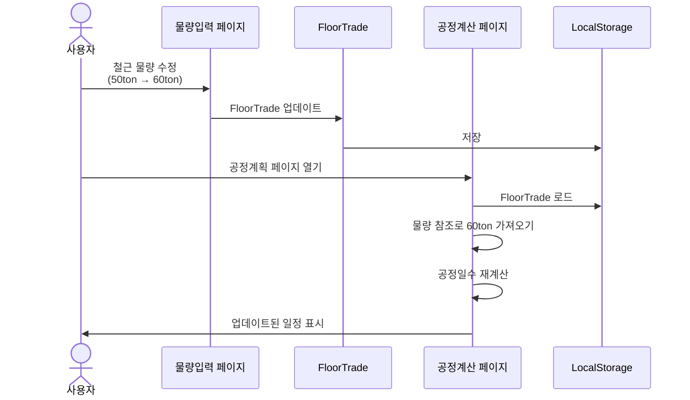

---

이로써 4부 공정 계산 로직이 완료되었습니다. 다음 섹션에서는 UI 컴포넌트를 상세히 다룹니다.

---

# 5부: UI 컴포넌트

## 5.1 동별공정계획표

### 5.1.1 컴포넌트 개요

**파일**: [`src/components/buildings/BuildingProcessPlanPage.tsx`](../src/components/buildings/BuildingProcessPlanPage.tsx)

**역할**: 프로젝트 내 모든 동의 공정계획을 수립하고 관리하는 메인 페이지

**주요 기능**:
- 동별 탭 네비게이션
- 6개 공정 구분 섹션
- 공정 타입 선택 드롭다운
- 세부공정 항목 테이블
- 실시간 자동 계산
- 순작업일 수동 오버라이드
- LocalStorage 저장/로드

### 5.1.2 컴포넌트 구조

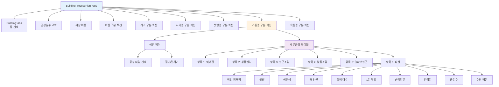

### 5.1.3 상태 관리

```typescript
export function BuildingProcessPlanPage({ projectId }: Props) {
  // 1. 동 목록
  const [buildings, setBuildings] = useState<Building[]>([]);
  
  // 2. 공정계획 맵 (buildingId → ProcessPlan)
  const [processPlans, setProcessPlans] = useState<Map<string, BuildingProcessPlan>>(
    new Map()
  );
  
  // 3. 로딩 상태
  const [isLoading, setIsLoading] = useState<boolean>(false);
  
  // 4. 섹션 접기/펼치기 상태 (buildingId-category 조합)
  const [expandedModules, setExpandedModules] = useState<Map<string, Set<string>>>(
    new Map()
  );
  
  // 5. 현재 선택된 동 인덱스
  const [activeBuildingIndex, setActiveBuildingIndex] = useState<number>(0);
  
  // 현재 동
  const currentBuilding = buildings[activeBuildingIndex];
  
  // 현재 동의 공정계획
  const currentPlan = processPlans.get(currentBuilding?.id);
}
```

### 5.1.4 데이터 로드

```typescript
// 초기 데이터 로드
useEffect(() => {
  async function loadData() {
    setIsLoading(true);
    
    try {
      // 1. 동 목록 로드
      const loadedBuildings = await getBuildings(projectId);
      setBuildings(loadedBuildings);
      
      // 2. 각 동의 공정계획 로드
      const plans = new Map<string, BuildingProcessPlan>();
      
      for (const building of loadedBuildings) {
        const key = `contech_process_plan_${building.id}`;
        const data = localStorage.getItem(key);
        
        if (data) {
          const plan = JSON.parse(data) as BuildingProcessPlan;
          plans.set(building.id, plan);
        } else {
          // 초기 공정계획 생성
          const initialPlan = createInitialProcessPlan(building);
          plans.set(building.id, initialPlan);
        }
      }
      
      setProcessPlans(plans);
    } catch (error) {
      console.error('Failed to load data:', error);
      toast.error('데이터 로드 실패');
    } finally {
      setIsLoading(false);
    }
  }
  
  loadData();
}, [projectId]);

// 초기 공정계획 생성
function createInitialProcessPlan(building: Building): BuildingProcessPlan {
  return {
    id: `plan-${building.id}`,
    buildingId: building.id,
    projectId: building.projectId,
    processes: {
      '버림': { days: 0, processType: '표준공정' },
      '기초': { days: 0, processType: '표준공정' },
      '지하층': { days: 0, processType: '표준공정' },
      '셋팅층': { days: 0, processType: '표준공정' },
      '기준층': { days: 0, processType: building.meta.standardFloorCycle ? `${building.meta.standardFloorCycle}일 사이클` : '6일 사이클' },
      '옥탑층': { days: 0, processType: '표준공정' },
    },
    totalDays: 0,
    createdAt: new Date().toISOString(),
    updatedAt: new Date().toISOString(),
  };
}
```

### 5.1.5 공정 타입 변경 핸들러

```typescript
const handleProcessTypeChange = useCallback((
  category: ProcessCategory,
  newProcessType: ProcessType
) => {
  if (!currentBuilding || !currentPlan) return;
  
  // 1. 공정계획 업데이트
  const updatedPlan: BuildingProcessPlan = {
    ...currentPlan,
    processes: {
      ...currentPlan.processes,
      [category]: {
        ...currentPlan.processes[category],
        processType: newProcessType,
        days: 0,  // 재계산 필요
      },
    },
    updatedAt: new Date().toISOString(),
  };
  
  // 2. 공정일수 재계산
  const calculatedDays = calculateCategoryDays(category, newProcessType, currentBuilding);
  updatedPlan.processes[category]!.days = calculatedDays;
  
  // 3. 전체 일수 재계산
  updatedPlan.totalDays = Object.values(updatedPlan.processes)
    .reduce((sum, p) => sum + (p?.days || 0), 0);
  
  // 4. 상태 업데이트
  setProcessPlans(prev => new Map(prev).set(currentBuilding.id, updatedPlan));
  
  // 5. LocalStorage 저장
  const key = `contech_process_plan_${currentBuilding.id}`;
  localStorage.setItem(key, JSON.stringify(updatedPlan));
  
  toast.success(`${category} 공정 타입이 변경되었습니다.`);
}, [currentBuilding, currentPlan]);
```

### 5.1.6 렌더링 예시

#### 공정 구분 섹션

```tsx
<div className="mb-6">
  {/* 헤더 */}
  <div className="flex items-center justify-between mb-4 p-4 bg-slate-50 dark:bg-slate-800 rounded-lg">
    <div className="flex items-center gap-4">
      <h3 className="text-lg font-semibold text-slate-900 dark:text-white">
        기준층
      </h3>
      
      {/* 공정 타입 선택 */}
      <select
        value={currentPlan?.processes['기준층']?.processType || '6일 사이클'}
        onChange={(e) => handleProcessTypeChange('기준층', e.target.value)}
        className="px-3 py-2 border rounded-lg"
      >
        <option value="5일 사이클">5일 사이클</option>
        <option value="6일 사이클">6일 사이클</option>
        <option value="7일 사이클">7일 사이클</option>
        <option value="8일 사이클">8일 사이클</option>
      </select>
      
      {/* 공정일수 표시 */}
      <span className="px-3 py-1 bg-blue-100 text-blue-700 rounded-full text-sm font-medium">
        {currentPlan?.processes['기준층']?.days || 0}일
      </span>
    </div>
    
    {/* 접기/펼치기 버튼 */}
    <button onClick={() => toggleExpand('기준층')}>
      {isExpanded ? <ChevronUp /> : <ChevronDown />}
    </button>
  </div>
  
  {/* 세부공정 테이블 (펼쳐진 상태) */}
  {isExpanded && (
    <table className="w-full text-sm">
      <thead>
        <tr className="bg-slate-100 dark:bg-slate-700">
          <th className="px-4 py-2">작업항목</th>
          <th className="px-4 py-2">물량</th>
          <th className="px-4 py-2">생산성</th>
          <th className="px-4 py-2">총인원</th>
          <th className="px-4 py-2">장비</th>
          <th className="px-4 py-2">1일투입</th>
          <th className="px-4 py-2">순작업일</th>
          <th className="px-4 py-2">간접일</th>
          <th className="px-4 py-2">총일수</th>
          <th className="px-4 py-2">수정</th>
        </tr>
      </thead>
      <tbody>
        {processItems.map(item => (
          <ProcessItemRow key={item.id} item={item} building={currentBuilding} />
        ))}
      </tbody>
    </table>
  )}
</div>
```

#### 세부공정 항목 행

```tsx
function ProcessItemRow({ item, building }: { item: ProcessItem; building: Building }) {
  // 물량 가져오기
  const quantity = item.quantityReference
    ? getQuantityByReference(item.quantityReference, floor, building)
    : 0;
  
  // 계산
  const totalWorkers = calculateTotalWorkers(quantity, item.dailyProductivity);
  const equipmentCount = item.equipmentCalculationBase
    ? calculateEquipmentCount(quantity, item.equipmentCalculationBase)
    : item.equipmentCount;
  const dailyInputWorkers = item.equipmentWorkersPerUnit
    ? equipmentCount * item.equipmentWorkersPerUnit
    : Math.ceil(totalWorkers / (item.directWorkDays || 1));
  const directWorkDays = item.directWorkDays
    ? item.directWorkDays
    : calculateWorkDaysWithRounding(quantity, item.dailyProductivity, dailyInputWorkers);
  const totalDays = calculateTotalWorkDays(directWorkDays, item.indirectDays);
  
  return (
    <tr className="border-b hover:bg-slate-50 dark:hover:bg-slate-800">
      <td className="px-4 py-2">{item.workItem}</td>
      <td className="px-4 py-2">{quantity.toFixed(2)} {item.unit}</td>
      <td className="px-4 py-2">{item.dailyProductivity}</td>
      <td className="px-4 py-2">{totalWorkers}명</td>
      <td className="px-4 py-2">{equipmentCount}대</td>
      <td className="px-4 py-2">{dailyInputWorkers}명</td>
      <td className="px-4 py-2">{directWorkDays}일</td>
      <td className="px-4 py-2">{item.indirectDays}일</td>
      <td className="px-4 py-2 font-semibold">{totalDays}일</td>
      <td className="px-4 py-2">
        <button onClick={() => handleEditDirectWorkDays(item)}>
          <Edit className="w-4 h-4" />
        </button>
      </td>
    </tr>
  );
}
```

### 5.1.7 순작업일 수동 오버라이드

```typescript
const handleEditDirectWorkDays = useCallback((item: ProcessItem) => {
  const currentValue = currentPlan?.itemDirectWorkDaysOverrides?.[item.id] || item.directWorkDays || 0;
  
  // 사용자 입력 받기
  const newValue = prompt(`순작업일을 입력하세요 (현재: ${currentValue}일):`, currentValue.toString());
  
  if (newValue === null) return;
  
  const parsedValue = parseFloat(newValue);
  
  if (isNaN(parsedValue) || parsedValue < 0) {
    toast.error('유효한 숫자를 입력하세요.');
    return;
  }
  
  // 오버라이드 저장
  const updatedPlan: BuildingProcessPlan = {
    ...currentPlan!,
    itemDirectWorkDaysOverrides: {
      ...currentPlan!.itemDirectWorkDaysOverrides,
      [item.id]: parsedValue,
    },
    updatedAt: new Date().toISOString(),
  };
  
  // 저장
  setProcessPlans(prev => new Map(prev).set(currentBuilding!.id, updatedPlan));
  localStorage.setItem(
    `contech_process_plan_${currentBuilding!.id}`,
    JSON.stringify(updatedPlan)
  );
  
  toast.success('순작업일이 수정되었습니다.');
}, [currentBuilding, currentPlan]);
```

---

## 5.2 지하층공정계획표

### 5.2.1 컴포넌트 개요

**파일**: [`src/components/buildings/BasementProcessPlanPage.tsx`](../src/components/buildings/BasementProcessPlanPage.tsx)

**역할**: 지하층 공정을 더 상세하게 관리하는 페이지

**추가 기능**:
- 가설공사/흙막이/토공사 일수 입력
- 주차장 및 3단 가시설 특수 물량 입력
- 층별 세부 공정 계획

### 5.2.2 지하층 특수 필드

```tsx
<Card className="p-6 mb-6">
  <h3 className="text-lg font-semibold mb-4">지하층 사전 공사</h3>
  
  <div className="grid grid-cols-3 gap-4">
    {/* 가설공사 */}
    <div>
      <label className="block text-sm font-medium mb-2">
        가설공사 일수
      </label>
      <Input
        type="number"
        value={currentPlan?.temporaryWorkDays || ''}
        onChange={(e) => handleTemporaryWorkDaysChange(parseInt(e.target.value))}
        placeholder="일수 입력"
      />
    </div>
    
    {/* 흙막이 공사 */}
    <div>
      <label className="block text-sm font-medium mb-2">
        흙막이 공사 일수
      </label>
      <Input
        type="number"
        value={currentPlan?.earthRetentionWorkDays || ''}
        onChange={(e) => handleEarthRetentionWorkDaysChange(parseInt(e.target.value))}
        placeholder="일수 입력"
      />
    </div>
    
    {/* 토공사 */}
    <div>
      <label className="block text-sm font-medium mb-2">
        토공사 일수
      </label>
      <Input
        type="number"
        value={currentPlan?.earthworkWorkDays || ''}
        onChange={(e) => handleEarthworkWorkDaysChange(parseInt(e.target.value))}
        placeholder="일수 입력"
      />
    </div>
  </div>
</Card>
```

### 5.2.3 주차장/가시설 특수 물량

```tsx
<Card className="p-6 mb-6">
  <h3 className="text-lg font-semibold mb-4">B1층 주차장 특수 물량</h3>
  
  <table className="w-full text-sm">
    <thead>
      <tr>
        <th>항목</th>
        <th>갱폼(㎡)</th>
        <th>알폼(㎡)</th>
        <th>형틀(㎡)</th>
        <th>철근(ton)</th>
        <th>콘크리트(㎥)</th>
      </tr>
    </thead>
    <tbody>
      {/* 주차장 */}
      <tr>
        <td>주차장</td>
        <td>
          <Input
            type="number"
            value={specialQuantities?.['B1-parking']?.gangForm || ''}
            onChange={(e) => handleSpecialQuantityChange('B1-parking', 'gangForm', e.target.value)}
          />
        </td>
        <td>
          <Input
            type="number"
            value={specialQuantities?.['B1-parking']?.alForm || ''}
            onChange={(e) => handleSpecialQuantityChange('B1-parking', 'alForm', e.target.value)}
          />
        </td>
        {/* ... 나머지 컬럼 */}
      </tr>
      
      {/* 3단 가시설 */}
      <tr>
        <td>3단 가시설 적용부</td>
        <td>
          <Input
            type="number"
            value={specialQuantities?.['B1-facility3']?.gangForm || ''}
            onChange={(e) => handleSpecialQuantityChange('B1-facility3', 'gangForm', e.target.value)}
          />
        </td>
        {/* ... 나머지 컬럼 */}
      </tr>
    </tbody>
  </table>
</Card>
```

---

## 5.3 대시보드 컴포넌트

### 5.3.1 ConstructionDashboard

**파일**: [`src/components/dashboard/ConstructionDashboard.tsx`](../src/components/dashboard/ConstructionDashboard.tsx)

**역할**: 프로젝트 전체 공정 현황을 한눈에 보여주는 대시보드

```tsx
export function ConstructionDashboard({ projectId }: Props) {
  return (
    <div className="space-y-6">
      <KPICards />
      <CCTVSection projectId={projectId} />
      <TaktView />
      <BuildingProgress />
    </div>
  );
}
```

### 5.3.2 KPICards (주요 지표)

```tsx
export function KPICards() {
  return (
    <div className="grid grid-cols-1 md:grid-cols-2 lg:grid-cols-4 gap-4">
      {/* 전체 진도율 */}
      <Card className="p-6">
        <div className="flex items-center justify-between mb-2">
          <h3 className="text-sm font-medium text-slate-500">전체 진도율</h3>
          <BarChart3 className="w-5 h-5 text-blue-500" />
        </div>
        <p className="text-3xl font-bold text-slate-900 dark:text-white">68%</p>
        <p className="text-xs text-slate-500 mt-1">목표 대비 +2%</p>
      </Card>
      
      {/* 금주 작업 */}
      <Card className="p-6">
        <div className="flex items-center justify-between mb-2">
          <h3 className="text-sm font-medium text-slate-500">금주 작업</h3>
          <Calendar className="w-5 h-5 text-emerald-500" />
        </div>
        <p className="text-3xl font-bold text-slate-900 dark:text-white">12</p>
        <p className="text-xs text-slate-500 mt-1">완료 8 / 진행 4</p>
      </Card>
      
      {/* 투입 인원 */}
      <Card className="p-6">
        <div className="flex items-center justify-between mb-2">
          <h3 className="text-sm font-medium text-slate-500">투입 인원</h3>
          <Users className="w-5 h-5 text-amber-500" />
        </div>
        <p className="text-3xl font-bold text-slate-900 dark:text-white">85명</p>
        <p className="text-xs text-slate-500 mt-1">전일 대비 +5명</p>
      </Card>
      
      {/* 지연 작업 */}
      <Card className="p-6">
        <div className="flex items-center justify-between mb-2">
          <h3 className="text-sm font-medium text-slate-500">지연 작업</h3>
          <AlertTriangle className="w-5 h-5 text-red-500" />
        </div>
        <p className="text-3xl font-bold text-red-600">2</p>
        <p className="text-xs text-slate-500 mt-1">조치 필요</p>
      </Card>
    </div>
  );
}
```

### 5.3.3 TaktView (동별 진행상황)

**파일**: [`src/components/dashboard/TaktView.tsx`](../src/components/dashboard/TaktView.tsx)

```tsx
export function TaktView() {
  const [filter, setFilter] = useState<string>('all');
  
  const allTasks: TaskItem[] = [
    { id: '1', building: '101동', floor: '7층', task: '거푸집 설치' },
    { id: '2', building: '102동', floor: '3층', task: '철근 배근' },
    { id: '3', building: '103동', floor: '10층', task: '콘크리트 타설' },
    // ... more tasks
  ];
  
  const filteredTasks = filter === 'all'
    ? allTasks
    : allTasks.filter(task => task.building === filter);
  
  return (
    <Card className="p-6">
      <div className="flex items-center justify-between mb-6">
        <h3 className="text-lg font-semibold">동별 진행상황</h3>
        
        {/* 필터 */}
        <Button variant="outline" size="sm" onClick={() => setFilterOpen(!filterOpen)}>
          <Filter className="w-4 h-4 mr-2" />
          필터
        </Button>
      </div>
      
      {/* 테이블 */}
      <table className="w-full text-sm">
        <thead>
          <tr>
            <th>동 (Building)</th>
            <th>층 (Floor)</th>
            <th>작업 내용 (Task)</th>
            <th>관리</th>
          </tr>
        </thead>
        <tbody>
          {filteredTasks.map(task => (
            <tr key={task.id}>
              <td>{task.building}</td>
              <td>{task.floor}</td>
              <td>{task.task}</td>
              <td>
                <Button variant="ghost" size="icon">
                  <MoreHorizontal className="w-4 h-4" />
                </Button>
              </td>
            </tr>
          ))}
        </tbody>
      </table>
    </Card>
  );
}
```

### 5.3.4 BuildingProgress (층별 진행률 히트맵)

**파일**: [`src/components/dashboard/BuildingProgress.tsx`](../src/components/dashboard/BuildingProgress.tsx)

```tsx
export function BuildingProgress() {
  const buildings = ['101동', '102동', '103동', '104동', '105동', '106동', '107동'];
  const floors = Array.from({ length: 20 }, (_, i) => 20 - i); // 20F ~ 1F
  
  const getFloorStatus = (building: string, floor: number) => {
    // 동별로 다른 진도 시뮬레이션
    const currentFloor = getCurrentFloor(building);
    
    if (floor < currentFloor) return { status: 'completed', label: '완료' };
    if (floor === currentFloor) return { status: 'in-progress', label: '진행중' };
    return { status: 'not-started', label: '미착수' };
  };
  
  const getStatusColor = (status: string) => {
    switch (status) {
      case 'completed': return 'bg-blue-500';
      case 'in-progress': return 'bg-emerald-500 animate-pulse';
      default: return 'bg-slate-200 dark:bg-slate-800';
    }
  };
  
  return (
    <Card className="p-6">
      <h3 className="text-lg font-semibold mb-4">전체 동 상세 진행률</h3>
      
      {/* 범례 */}
      <div className="flex gap-4 text-xs mb-4">
        <div className="flex items-center gap-2">
          <div className="w-3 h-3 rounded bg-blue-500" />
          <span>완료</span>
        </div>
        <div className="flex items-center gap-2">
          <div className="w-3 h-3 rounded bg-emerald-500" />
          <span>진행중</span>
        </div>
        <div className="flex items-center gap-2">
          <div className="w-3 h-3 rounded bg-slate-200 dark:bg-slate-800" />
          <span>미착수</span>
        </div>
      </div>
      
      {/* 히트맵 */}
      <div className="overflow-x-auto">
        {/* 헤더 (동 이름) */}
        <div className="flex mb-2">
          <div className="w-12" /> {/* Y축 라벨 공간 */}
          {buildings.map(building => (
            <div key={building} className="flex-1 text-center text-sm font-medium">
              {building}
            </div>
          ))}
        </div>
        
        {/* 층별 행 */}
        {floors.map(floor => (
          <div key={floor} className="flex items-center gap-1 mb-1">
            {/* Y축 라벨 (층수) */}
            <div className="w-12 text-right pr-3 text-xs text-slate-500">
              {floor}F
            </div>
            
            {/* 동별 셀 */}
            {buildings.map(building => {
              const { status, label } = getFloorStatus(building, floor);
              return (
                <TooltipProvider key={`${building}-${floor}`}>
                  <Tooltip>
                    <TooltipTrigger asChild>
                      <div
                        className={`flex-1 h-6 rounded-sm transition-colors cursor-pointer ${getStatusColor(status)}`}
                      />
                    </TooltipTrigger>
                    <TooltipContent>
                      <p className="font-semibold">{building} {floor}층</p>
                      <p className="text-xs">{label}</p>
                    </TooltipContent>
                  </Tooltip>
                </TooltipProvider>
              );
            })}
          </div>
        ))}
      </div>
    </Card>
  );
}
```

---

이로써 5부 UI 컴포넌트가 완료되었습니다. 다음 섹션에서는 간트차트 통합을 다룹니다.

---

# 6부: 간트차트 통합

## 6.1 통합 계획

### 6.1.1 개요

ConTech-DX는 **sa-gantt-lib** 라이브러리를 사용하여 공정계획을 간트차트로 시각화합니다.

**통합 문서**: [`docs/GANTT_INTEGRATION_PLAN.md`](./GANTT_INTEGRATION_PLAN.md)

#### 주요 결정 사항

| 항목 | 결정 | 이유 |
|------|------|------|
| **라이브러리** | sa-gantt-lib | 자체 개발, Tailwind CSS v4 호환, React 19 지원 |
| **설치 방식** | npm pack → tarball 설치 | 프라이빗 패키지 로컬 배포 |
| **데이터 계층** | 2단계 (동 → 공정) | Level 1: 동(CP), Level 2: 공정(TASK) |
| **의존성 처리** | 자동 순차 | 버림 → 기초 → 지하층 → 셋팅층 → 기준층 → 옥탑층 |

### 6.1.2 WBS 구조

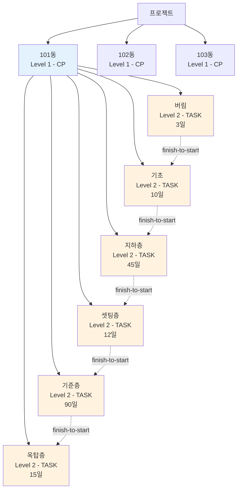

**WBS 예시**:
```
프로젝트
├── 101동 (CP)
│   ├── 버림 (TASK) - 3일
│   ├── 기초 (TASK) - 10일 (버림 완료 후 시작)
│   ├── 지하층 (TASK) - 45일 (기초 완료 후 시작)
│   ├── 셋팅층 (TASK) - 12일
│   ├── 기준층 (TASK) - 90일
│   └── 옥탑층 (TASK) - 15일
├── 102동 (CP)
│   └── ... (동일 구조)
└── 103동 (CP)
    └── ... (동일 구조)
```

### 6.1.3 기술 호환성

| 항목 | ConTech-DX | sa-gantt-lib | 호환 |
|------|------------|--------------|------|
| **React** | 19.2.0 | ^18 \|\| ^19 | ✅ |
| **TailwindCSS** | v4 | v4 | ✅ |
| **다크모드** | `.dark` 클래스 | `.dark` 클래스 | ✅ |
| **date-fns** | 4.x | 4.x | ✅ |
| **TypeScript** | 5.x | 5.x | ✅ |

---

## 6.2 데이터 변환 레이어

### 6.2.1 변환 흐름

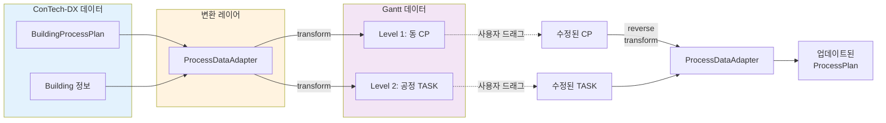

### 6.2.2 ProcessDataAdapter 설계

**파일**: `src/components/gantt/ProcessDataAdapter.ts` (생성 예정)

#### 핵심 함수

```typescript
/**
 * BuildingProcessPlan → ConstructionTask[] 변환
 */
export function transformBuildingProcessPlanToTasks(
  buildings: Building[],
  processPlans: Map<string, BuildingProcessPlan>
): ConstructionTask[] {
  const tasks: ConstructionTask[] = [];
  let taskId = 1;
  
  buildings.forEach((building, index) => {
    const plan = processPlans.get(building.id);
    if (!plan) return;
    
    // Level 1: 동 (CP)
    const cpTask: ConstructionTask = {
      id: `cp-${building.id}`,
      parentId: null,
      wbsLevel: 1,
      type: 'CP',
      name: building.buildingName,
      startDate: calculateBuildingStartDate(building, index),
      endDate: calculateBuildingEndDate(building, plan),
      cp: {
        cpId: building.id,
        cpName: building.buildingName,
        zone: building.buildingNumber.toString(),
      },
      dependencies: [],
    };
    tasks.push(cpTask);
    
    // Level 2: 공정 (TASK)
    const categories: ProcessCategory[] = [
      '버림', '기초', '지하층', '셋팅층', '기준층', '옥탑층'
    ];
    
    let currentStartDate = cpTask.startDate;
    let prevTaskId: string | null = null;
    
    categories.forEach((category) => {
      const processInfo = plan.processes[category];
      if (!processInfo || processInfo.days === 0) return;
      
      const taskStartDate = currentStartDate;
      const taskEndDate = addWorkingDays(taskStartDate, processInfo.days);
      
      const processTask: ConstructionTask = {
        id: `task-${building.id}-${category}`,
        parentId: cpTask.id,
        wbsLevel: 2,
        type: 'TASK',
        name: `${building.buildingName} ${category}`,
        startDate: taskStartDate,
        endDate: taskEndDate,
        task: {
          taskId: `${building.id}-${category}`,
          taskName: category,
          duration: processInfo.days,
        },
        dependencies: prevTaskId
          ? [{ predecessorId: prevTaskId, type: 'finish-to-start', lag: 0 }]
          : [],
      };
      
      tasks.push(processTask);
      
      currentStartDate = taskEndDate;
      prevTaskId = processTask.id;
    });
  });
  
  return tasks;
}

/**
 * ConstructionTask[] → BuildingProcessPlan 역변환
 * (간트차트에서 수정된 일정을 공정계획에 반영)
 */
export function updateProcessPlanFromTask(
  task: ConstructionTask,
  processPlans: Map<string, BuildingProcessPlan>
): BuildingProcessPlan | null {
  // 1. Task ID에서 buildingId와 category 추출
  const match = task.id.match(/^task-(.+)-(.+)$/);
  if (!match) return null;
  
  const [, buildingId, category] = match;
  const plan = processPlans.get(buildingId);
  if (!plan) return null;
  
  // 2. 새로운 일수 계산
  const newDays = calculateWorkingDaysBetween(task.startDate, task.endDate);
  
  // 3. 공정계획 업데이트
  const updatedPlan: BuildingProcessPlan = {
    ...plan,
    processes: {
      ...plan.processes,
      [category as ProcessCategory]: {
        ...plan.processes[category as ProcessCategory]!,
        days: newDays,
      },
    },
    totalDays: Object.values(plan.processes)
      .reduce((sum, p) => sum + ((p?.days || 0) === plan.processes[category as ProcessCategory]!.days ? newDays : (p?.days || 0)), 0),
    updatedAt: new Date().toISOString(),
  };
  
  return updatedPlan;
}

// 헬퍼 함수: 작업일 계산
function calculateWorkingDaysBetween(start: Date, end: Date): number {
  let count = 0;
  const current = new Date(start);
  
  while (current <= end) {
    const dayOfWeek = current.getDay();
    // 주말 제외 (토요일=6, 일요일=0)
    if (dayOfWeek !== 0 && dayOfWeek !== 6) {
      count++;
    }
    current.setDate(current.getDate() + 1);
  }
  
  return count;
}

// 헬퍼 함수: 작업일 추가
function addWorkingDays(date: Date, days: number): Date {
  const result = new Date(date);
  let remainingDays = days;
  
  while (remainingDays > 0) {
    result.setDate(result.getDate() + 1);
    const dayOfWeek = result.getDay();
    if (dayOfWeek !== 0 && dayOfWeek !== 6) {
      remainingDays--;
    }
  }
  
  return result;
}
```

### 6.2.3 GanttChart 컴포넌트

**파일**: `src/components/gantt/ProcessGanttChart.tsx` (생성 예정)

```typescript
'use client';

import { useState, useEffect, useCallback } from 'react';
import { GanttChart } from 'sa-gantt-lib';
import type { ConstructionTask, Milestone } from 'sa-gantt-lib';
import { getBuildings } from '@/lib/services/buildings';
import { transformBuildingProcessPlanToTasks, updateProcessPlanFromTask } from './ProcessDataAdapter';
import { toast } from 'sonner';

interface Props {
  projectId: string;
}

export function ProcessGanttChart({ projectId }: Props) {
  const [tasks, setTasks] = useState<ConstructionTask[]>([]);
  const [milestones, setMilestones] = useState<Milestone[]>([]);
  const [isLoading, setIsLoading] = useState(true);
  
  // 데이터 로드
  useEffect(() => {
    async function loadData() {
      try {
        setIsLoading(true);
        
        // 1. 동 목록 로드
        const buildings = await getBuildings(projectId);
        
        // 2. 공정계획 로드
        const processPlans = new Map<string, BuildingProcessPlan>();
        buildings.forEach((building) => {
          const key = `contech_process_plan_${building.id}`;
          const data = localStorage.getItem(key);
          if (data) {
            processPlans.set(building.id, JSON.parse(data));
          }
        });
        
        // 3. Gantt 데이터로 변환
        const ganttTasks = transformBuildingProcessPlanToTasks(buildings, processPlans);
        setTasks(ganttTasks);
        
      } catch (error) {
        console.error('Failed to load gantt data:', error);
        toast.error('간트차트 데이터 로드 실패');
      } finally {
        setIsLoading(false);
      }
    }
    
    loadData();
  }, [projectId]);
  
  // Task 업데이트 핸들러
  const handleTaskUpdate = useCallback((updatedTask: ConstructionTask) => {
    // 1. 공정계획 업데이트
    const updatedPlan = updateProcessPlanFromTask(updatedTask, processPlans);
    
    if (updatedPlan) {
      // 2. LocalStorage 저장
      const key = `contech_process_plan_${updatedPlan.buildingId}`;
      localStorage.setItem(key, JSON.stringify(updatedPlan));
      
      // 3. UI 업데이트
      setTasks(prev => prev.map(t => t.id === updatedTask.id ? updatedTask : t));
      
      toast.success('공정계획이 업데이트되었습니다.');
    }
  }, [processPlans]);
  
  // 뷰 변경 핸들러
  const handleViewChange = useCallback((view: 'MASTER' | 'DETAIL', cpId?: string) => {
    console.log('View changed:', view, cpId);
  }, []);
  
  if (isLoading) {
    return <div className="flex items-center justify-center h-96">로딩 중...</div>;
  }
  
  return (
    <div className="w-full h-[800px]">
      <GanttChart
        tasks={tasks}
        milestones={milestones}
        initialView="MASTER"
        initialZoomLevel="MONTH"
        onTaskUpdate={handleTaskUpdate}
        onViewChange={handleViewChange}
      />
    </div>
  );
}
```

---

## 6.3 구현 체크리스트

### 6.3.1 패키지 설치

```bash
# 1. sa-gantt-lib 빌드 (별도 프로젝트)
cd /path/to/sa-gantt-lib
npm run build
npm pack
# → sa-gantt-lib-0.1.0-beta.tgz 생성

# 2. ConTech-DX에 설치
cd /path/to/contech-dx
npm install ../sa-gantt-lib/sa-gantt-lib-0.1.0-beta.tgz
```

### 6.3.2 CSS 임포트

**파일**: `src/app/layout.tsx`

```typescript
import 'sa-gantt-lib/dist/style.css';  // globals.css 뒤에 추가
```

### 6.3.3 컴포넌트 생성

**디렉토리 구조**:
```
src/components/gantt/
├── index.ts                    # 배럴 익스포트
├── types.ts                    # 통합용 타입 정의
├── ProcessDataAdapter.ts       # 데이터 변환 레이어
├── useProcessGanttData.ts      # 데이터 로드/저장 훅
└── ProcessGanttChart.tsx       # 메인 컴포넌트
```

**생성할 파일 목록**:

| 파일 | 역할 | 라인 수 (예상) |
|------|------|---------------|
| `index.ts` | 배럴 익스포트 | 10 |
| `types.ts` | 타입 정의 | 50 |
| `ProcessDataAdapter.ts` | 변환 함수 | 200 |
| `useProcessGanttData.ts` | 데이터 훅 | 100 |
| `ProcessGanttChart.tsx` | 메인 컴포넌트 | 150 |

### 6.3.4 ProjectDetailClient 업데이트

**파일**: `src/components/projects/ProjectDetailClient.tsx`

**변경 전**:
```tsx
{/* 간트차트 탭 - 플레이스홀더 */}
{activeTab === 'gantt' && (
  <div className="p-8">
    <Card className="p-12 text-center">
      <Calendar className="w-16 h-16 mx-auto mb-4 text-slate-400" />
      <h3 className="text-xl font-semibold mb-2">간트차트 (준비중)</h3>
      <p className="text-slate-600 dark:text-slate-400">
        동별 공정계획을 간트차트로 시각화합니다.
      </p>
    </Card>
  </div>
)}
```

**변경 후**:
```tsx
{/* 간트차트 탭 */}
{activeTab === 'gantt' && (
  <div className="p-8">
    <ProcessGanttChart projectId={project.id} />
  </div>
)}
```

### 6.3.5 테스트 시나리오

#### 시나리오 1: 기본 렌더링

1. 프로젝트 상세 페이지 접속
2. "간트차트" 탭 클릭
3. 모든 동의 공정이 타임라인으로 표시되는지 확인
4. Master View에서 전체 프로젝트 일정 확인

**예상 결과**:
- 101동, 102동, 103동 ... 순서대로 표시
- 각 동 하위에 6개 공정 (버림→옥탑층) 표시
- 순차 의존성 화살표 표시

#### 시나리오 2: Detail View 전환

1. Master View에서 특정 동(예: 101동) 클릭
2. Detail View로 전환
3. 해당 동의 세부 공정만 확대 표시

**예상 결과**:
- 101동의 6개 공정이 크게 표시
- Zoom Level 자동 조정 (MONTH → WEEK)
- 뒤로가기 버튼으로 Master View 복귀

#### 시나리오 3: 일정 드래그 수정

1. Detail View에서 "기준층" 작업 선택
2. 타임라인을 드래그하여 일정 조정 (90일 → 100일)
3. 변경사항 저장 확인

**예상 결과**:
- 기준층 일정이 시각적으로 변경
- 후속 작업(옥탑층) 자동 이동
- 토스트 메시지: "공정계획이 업데이트되었습니다."
- 동별공정계획표 페이지에서 변경사항 반영 확인

#### 시나리오 4: 의존성 유지

1. "버림" 작업 일정 변경
2. 후속 작업들이 연쇄적으로 이동하는지 확인

**예상 결과**:
- 버림 → 기초 → 지하층 → ... 모든 작업이 순차 이동
- 의존성 화살표 유지
- 전체 프로젝트 일정 재계산

---

이로써 6부 간트차트 통합이 완료되었습니다. 다음 섹션에서는 사용자 가이드를 제공합니다.

---

# 7부: 사용자 가이드

## 7.1 공정계획 수립 프로세스

### 7.1.1 전체 프로세스

```mermaid
graph TD
    Start[시작] --> Step1[1. 프로젝트 생성]
    Step1 --> Step2[2. 동 추가]
    Step2 --> Step3[3. 동 기본정보 입력]
    Step3 --> Step4[4. 층 설정]
    Step4 --> Step5[5. 물량 입력]
    Step5 --> Step6[6. 공정계획 수립]
    Step6 --> Step7[7. 간트차트 확인]
    Step7 --> Decision{수정 필요?}
    Decision -->|Yes| Step6
    Decision -->|No| End[완료]
    
    style Step6 fill:#fff3e0
    style Step7 fill:#e3f2fd
```

### 7.1.2 단계별 상세 가이드

#### 1단계: 프로젝트 생성

1. 메인 메뉴에서 **"프로젝트"** 클릭
2. **"+ 새 프로젝트"** 버튼 클릭
3. 프로젝트 정보 입력:
   - 프로젝트명 (예: "○○아파트 신축공사")
   - 위치 (예: "서울특별시 강남구")
   - 발주처 (예: "○○건설")
   - 시작일 / 종료일
   - 계약금액
4. **"생성"** 버튼 클릭

#### 2단계: 동 추가

1. 프로젝트 상세 페이지 진입
2. **"동 관리"** 탭 클릭
3. **"+ 동 추가"** 버튼 클릭
4. 동 기본 정보 입력:
   - 동 이름 (예: "101동")
   - 동 번호 (예: 1)
5. **"추가"** 버튼 클릭
6. 필요한 만큼 동 추가 반복

#### 3단계: 동 기본정보 입력

1. **"동 기본정보"** 탭 클릭
2. 상단에서 동 선택 (예: 101동)
3. 정보 입력:
   - **총 세대수**: 150세대
   - **코어 개수**: 1개 (또는 2~4개)
   - **코어 타입**: 중복도(판상형)
   - **슬라브 타입**: 벽식구조
   - **층수**:
     - 지하층: 2개 (B2, B1)
     - 지상층: 20개 (1F~20F)
     - 옥탑층: 1개 (PH1)
   - **층고** (mm):
     - 지하2층: 3500
     - 지하1층: 3500
     - 1층: 3200
     - 기준층: 2950
     - 최상층: 2950
     - 옥탑층: 2650
   - **기준층 사이클**: 6일
   - **펌프카 최대 대수**: 2대
4. **"저장"** 버튼 클릭

#### 4단계: 층 설정

1. **"층 설정"** 섹션에서 자동 생성된 층 목록 확인
2. 필요 시 층 분류 변경:
   - 1층: 셋팅층
   - 2~5층: 일반층
   - 6~19층: 기준층
   - 20층: 최상층
   - PH1: 옥탑층
3. 층고 조정 (필요 시):
   - 특정 층 클릭 → 층고 수정
   - 예: 1층 층고를 3500으로 변경
4. **"저장"** 버튼 클릭

#### 5단계: 물량 입력

1. **"물량입력"** 탭 클릭
2. 층별로 물량 입력:

**버림** (B3 레벨):
- 형틀: 200 ㎡
- 콘크리트: 80 ㎥

**기초**:
- 형틀: 500 ㎡
- 철근: 50 ton
- 콘크리트: 300 ㎥

**B2층**:
- 갱폼: 850 ㎡
- 알폼: 1200 ㎡
- 형틀: 2050 ㎡
- 철근: 120 ton
- 콘크리트: 600 ㎥

**기준층 (4층 기준)**:
- 갱폼: 120 ㎡
- 알폼: 1731 ㎡
- 철근: 18.83 ton
- 콘크리트: 245 ㎥

3. **"저장"** 버튼 클릭

#### 6단계: 공정계획 수립

1. **"동별공정계획"** 탭 클릭
2. 상단에서 동 선택 (예: 101동)
3. 각 공정 구분별로 공정 타입 선택:

**버림**: 표준공정 (자동 계산 → 약 3일)

**기초**: 표준공정 (자동 계산 → 약 10일)

**지하층**: 표준공정 (자동 계산 → 약 45일)

**셋팅층**: 표준공정 (자동 계산 → 약 12일)

**기준층**: 
   - 공정 타입: **6일 사이클** 선택
   - 기준층 수: 14개 (6F~19F)
   - 자동 계산: 14층 × 6일 = 84일

**옥탑층**: 표준공정 (자동 계산 → 약 15일)

4. 세부공정 항목 확인:
   - **"기준층"** 섹션 펼치기
   - 6개 항목 확인:
     1. 먹매김 (1일)
     2. 갱폼설치 (1일)
     3. 옹벽철근 조립 (1일)
     4. 알폼조립 (1일)
     5. 슬라브철근 조립 (1일)
     6. 타설 (1일) + 양생 (2일)
   - 총 6일 사이클 확인

5. 필요 시 순작업일 수동 조정:
   - 특정 항목의 **"수정"** 버튼 클릭
   - 새로운 일수 입력
   - 확인

6. 전체 공정일수 확인:
   - 화면 하단 **"공정일수 요약"** 섹션
   - 버림(3) + 기초(10) + 지하층(45) + 셋팅층(12) + 기준층(84) + 옥탑층(15) = **169일**

7. **"저장"** 버튼 클릭

#### 7단계: 간트차트 확인

1. **"간트차트"** 탭 클릭
2. 전체 프로젝트 일정을 타임라인으로 확인:
   - 101동: 169일
   - 102동: 169일
   - 103동: 169일
3. Detail View로 전환:
   - 특정 동(예: 101동) 클릭
   - 세부 공정별 일정 확인
4. 필요 시 드래그로 일정 조정:
   - "기준층" 작업 선택
   - 드래그하여 일정 변경
   - 자동 저장 확인

---

## 7.2 주요 기능 설명

### 7.2.1 공정 타입 변경 시 재계산

**기능**: 공정 타입을 변경하면 세부공정 항목과 일수가 자동으로 재계산됩니다.

**사용 방법**:
1. 공정 구분 섹션의 **드롭다운** 클릭
2. 새로운 공정 타입 선택 (예: 6일 사이클 → 7일 사이클)
3. 자동 재계산 확인:
   - 세부공정 항목이 새로운 모듈 데이터로 교체
   - 각 항목의 일수가 재계산
   - 전체 공정일수 업데이트

**예시**:
```
변경 전: 기준층 6일 사이클 → 14층 × 6일 = 84일
변경 후: 기준층 7일 사이클 → 14층 × 7일 = 98일
차이: +14일
```

### 7.2.2 순작업일 수동 오버라이드

**기능**: 자동 계산된 순작업일을 사용자가 직접 수정할 수 있습니다.

**사용 방법**:
1. 세부공정 테이블에서 수정할 항목의 **"수정"** 버튼 클릭
2. 프롬프트 창에 새로운 일수 입력 (예: 1 → 2)
3. 확인
4. 해당 항목의 순작업일과 총일수가 즉시 업데이트

**주의 사항**:
- 오버라이드된 값은 **공정 타입을 변경해도 유지**됩니다.
- 오버라이드를 해제하려면 **다시 자동 계산값으로 입력**하면 됩니다.

**오버라이드 저장 위치**:
```typescript
BuildingProcessPlan.itemDirectWorkDaysOverrides
// 예: { "standard-gangform-6day": 2 }
```

### 7.2.3 층별 공정 타입 개별 설정

**기능**: 기준층 중 특정 층만 다른 공정 타입을 적용할 수 있습니다.

**사용 사례**:
- 4층에 필로티가 있어 작업이 복잡함 → 7일 사이클 적용
- 10층에 특수 구조물이 있음 → 8일 사이클 적용

**사용 방법** (현재 UI 미구현, 데이터 모델만 준비됨):
```typescript
// 프로그래밍 방식으로 설정
const processPlan: BuildingProcessPlan = {
  processes: {
    '기준층': {
      days: 90,
      processType: '6일 사이클',  // 기본값
      floors: {
        '4F': { processType: '7일 사이클' },  // 4층만 7일
        '10F': { processType: '8일 사이클' }, // 10층만 8일
      }
    }
  }
};
```

**향후 UI 구현 예정**:
- 층별 공정 타입 선택 드롭다운
- 기준층 섹션에서 층 목록 펼치기
- 각 층마다 개별 공정 타입 선택 가능

### 7.2.4 데이터 내보내기/가져오기

**기능**: 공정계획 데이터를 JSON 파일로 내보내거나 가져올 수 있습니다.

**내보내기**:
```typescript
// 버튼 클릭 시 실행되는 함수
function exportProcessPlan(buildingId: string) {
  const key = `contech_process_plan_${buildingId}`;
  const data = localStorage.getItem(key);
  
  if (!data) {
    toast.error('저장된 공정계획이 없습니다.');
    return;
  }
  
  const blob = new Blob([data], { type: 'application/json' });
  const url = URL.createObjectURL(blob);
  const a = document.createElement('a');
  a.href = url;
  a.download = `process_plan_${buildingId}_${Date.now()}.json`;
  a.click();
  URL.revokeObjectURL(url);
}
```

**가져오기**:
```typescript
// 파일 선택 시 실행되는 함수
function importProcessPlan(file: File, buildingId: string) {
  const reader = new FileReader();
  
  reader.onload = (e) => {
    try {
      const data = e.target?.result as string;
      const plan = JSON.parse(data) as BuildingProcessPlan;
      
      // 유효성 검증
      if (!plan.buildingId || !plan.processes) {
        throw new Error('유효하지 않은 공정계획 파일입니다.');
      }
      
      // LocalStorage에 저장
      const key = `contech_process_plan_${buildingId}`;
      localStorage.setItem(key, data);
      
      toast.success('공정계획을 가져왔습니다.');
      
      // 페이지 새로고침
      window.location.reload();
      
    } catch (error) {
      console.error('Failed to import:', error);
      toast.error('가져오기 실패: 파일 형식이 올바르지 않습니다.');
    }
  };
  
  reader.readAsText(file);
}
```

---

## 7.3 문제 해결 가이드

### 7.3.1 계산 결과가 이상할 때

#### 문제 1: 공정일수가 0일로 표시됨

**원인**:
- 물량이 입력되지 않음
- 공정 타입이 선택되지 않음

**해결 방법**:
1. **"물량입력"** 탭에서 해당 층의 물량 확인
2. 갱폼, 알폼, 형틀, 철근, 콘크리트 값이 모두 0이 아닌지 확인
3. 물량 입력 후 **"저장"** 버튼 클릭
4. **"동별공정계획"** 탭으로 돌아와서 자동 재계산 확인

#### 문제 2: 기준층 일수가 예상보다 너무 짧거나 길음

**원인**:
- 기준층 범위가 잘못 설정됨
- 층고가 잘못 입력됨

**해결 방법**:
1. **"동 기본정보"** 탭에서 **"층 설정"** 섹션 확인
2. 기준층으로 분류된 층 개수 확인 (예: 6~19F = 14개층)
3. 계산 검증:
   - 6일 사이클 × 14개층 = 84일
   - 실제 표시된 일수와 비교
4. 층 분류가 잘못된 경우:
   - 해당 층 클릭
   - 층 분류 변경 (기준층 / 일반층 / 최상층 등)
   - **"저장"** 후 공정계획 재확인

#### 문제 3: 장비 대수 계산이 이상함

**원인**:
- `equipmentCalculationBase` 값이 잘못됨
- 물량이 비정상적으로 큼

**해결 방법**:
1. 세부공정 테이블에서 해당 항목의 물량 확인
2. 예상 장비 대수 계산:
   ```
   콘크리트 300㎥ / 펌프카 대당 650㎥ = 0.46
   → CEILING(MIN(2, 0.46), 1) = 1대 (정상)
   
   콘크리트 1500㎥ / 펌프카 대당 650㎥ = 2.31
   → CEILING(MIN(2, 2.31), 1) = 2대 (정상)
   ```
3. 계산이 맞지 않으면 물량표 재확인

### 7.3.2 데이터가 저장되지 않을 때

#### 문제 1: 저장 버튼을 눌러도 변경사항이 반영 안 됨

**원인**:
- LocalStorage 용량 초과
- 브라우저 시크릿 모드 사용 중
- LocalStorage 비활성화

**해결 방법**:
1. 브라우저 콘솔(F12) 열기
2. Console 탭에서 에러 메시지 확인
3. LocalStorage 용량 확인:
   ```javascript
   // 콘솔에 입력
   let total = 0;
   for (let key in localStorage) {
     if (localStorage.hasOwnProperty(key)) {
       total += localStorage[key].length;
     }
   }
   console.log(`LocalStorage 사용량: ${(total / 1024).toFixed(2)} KB`);
   ```
4. 용량 초과 시:
   - 불필요한 프로젝트 데이터 삭제
   - 또는 중요 데이터를 JSON으로 내보내기 후 LocalStorage 초기화

#### 문제 2: 다른 브라우저에서 데이터가 안 보임

**원인**:
- LocalStorage는 **브라우저별로 독립적**으로 저장됨

**해결 방법**:
1. 데이터를 내보내기 (JSON 파일로 저장)
2. 다른 브라우저에서 데이터 가져오기
3. 또는 항상 **같은 브라우저** 사용

**향후 해결책**:
- Supabase DB 연동 후에는 계정 기반으로 모든 브라우저에서 접근 가능

#### 문제 3: 새로고침 후 데이터가 사라짐

**원인**:
- 브라우저 시크릿 모드 사용 중
- 브라우저 캐시 자동 삭제 설정

**해결 방법**:
1. **시크릿 모드를 사용하지 마세요**
2. 브라우저 설정에서 "종료 시 쿠키 및 사이트 데이터 삭제" 옵션 끄기
3. 중요 데이터는 **정기적으로 내보내기** 백업

### 7.3.3 브라우저 호환성 이슈

#### 지원 브라우저

| 브라우저 | 최소 버전 | 권장 버전 | 지원 상태 |
|---------|----------|----------|----------|
| **Chrome** | 90+ | 최신 | ✅ 완전 지원 |
| **Edge** | 90+ | 최신 | ✅ 완전 지원 |
| **Firefox** | 88+ | 최신 | ✅ 완전 지원 |
| **Safari** | 14+ | 최신 | ⚠️ 부분 지원 |
| **IE 11** | - | - | ❌ 미지원 |

#### Safari 알려진 이슈

**문제**: date-fns 일부 기능 오류

**해결 방법**:
- Safari 15 이상으로 업데이트
- 또는 Chrome/Edge 사용 권장

#### 모바일 브라우저

| 플랫폼 | 브라우저 | 지원 상태 |
|--------|---------|----------|
| iOS | Safari | ✅ 지원 |
| iOS | Chrome | ✅ 지원 |
| Android | Chrome | ✅ 지원 |
| Android | Samsung Internet | ✅ 지원 |

**주의**: 모바일에서는 **가로 모드 권장** (간트차트 가시성)

---

## 마치며

이 문서는 ConTech-DX 공정관리 시스템의 전체 구조와 사용 방법을 상세히 다루었습니다.

### 추가 문서

- **간트차트 통합 계획**: [`GANTT_INTEGRATION_PLAN.md`](./GANTT_INTEGRATION_PLAN.md)
- **Supabase 마이그레이션 계획**: [`SUPABASE_MIGRATION.md`](./SUPABASE_MIGRATION.md)
- **엑셀 상세분석 보고서**: [`엑셀_상세분석보고서_업데이트.md`](./엑셀_상세분석보고서_업데이트.md)

### 문의 및 지원

- **GitHub Issues**: 버그 리포트 및 기능 제안
- **기술 문서**: `docs/` 폴더 참조
- **개발 가이드**: `README.md` 참조

---

**문서 버전**: 1.0.0  
**최종 수정일**: 2025년 1월  
**작성자**: ConTech-DX Development Team


