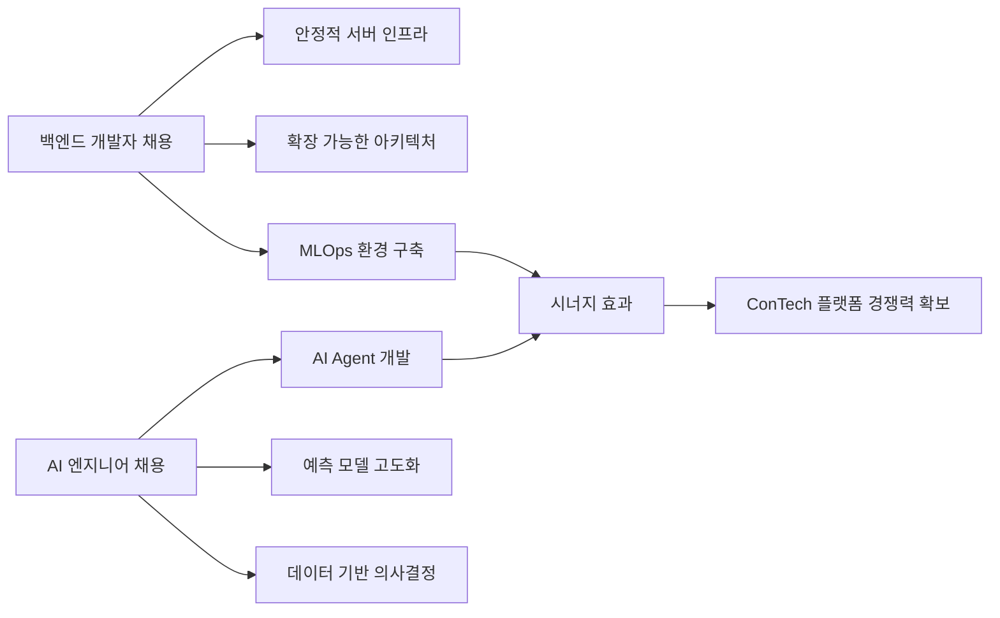

# ConTech SaaS 플랫폼 구축을 위한 인력 채용 보고자료

## 1. 개요

### 1.1 배경
현재 건설그룹에서 직영공사에 대한 **PMIS(Project Management Information System)** 기반 ConTech SaaS 플랫폼을 구축 중이며, 다음과 같은 핵심 기능을 포함:

- 공정관리 시스템
- 공사일보 관리
- EVMS (Earned Value Management System) 대시보드
- 건설 데이터 축적 및 분석

### 1.2 현재 인력 구성
| 구분 | 역할 | 비고 |
|------|------|------|
| 기존 인력 | 풀스택 개발자 + AI 엔지니어 | 아키텍트 역할 수행 |

### 1.3 추가 채용 필요 인력
| 포지션 | 인원 | 목적 |
|--------|------|------|
| 백엔드 개발자 | 1명 | 안정적인 서버 인프라 및 API 개발 |
| AI 엔지니어 | 1명 | 공정관리 AI Agent 개발 |

---

## 2. 건설산업 AI/DX 트렌드 분석

### 2.1 글로벌 ConTech 시장 동향

> **2024-2025년 주요 트렌드**: AI가 건설 산업의 생산성을 **25% 이상** 향상하고, 공사 기간 및 재해율을 **25% 이상** 감축할 것으로 예상

#### 주요 적용 영역

| 영역 | AI 적용 사례 | 대표 솔루션 |
|------|-------------|-------------|
| **예측 분석** | 프로젝트 지연 예측, 리스크 식별 | NPlan, ALICE Technologies |
| **공정 최적화** | 일정 자동화, 자원 할당 최적화 | Planera, Autodesk AI |
| **현장 모니터링** | 드론 + 컴퓨터 비전 기반 실시간 추적 | OpenSpace, Buildots |
| **품질/안전 관리** | 안전 위반 감지, 부실시공 예방 | Upsight(업사이트) |
| **BIM 통합** | 생성적 설계, 성능 분석 | Autodesk Construction Cloud |
| **문서 자동화** | NLP 기반 계약서/보고서 처리 | Procore |

### 2.2 국내 ConTech 동향

- **GS건설 등 주요 건설사**: AI 엔지니어 신입 공개 채용 시작
- **업사이트(Upsight)**: AI/딥러닝 기반 공정 및 품질 관리 솔루션 개발
- **ARCHONIX**: BIM+AI 융합 프리콘 자동화 기술 (2025 스마트 건설 챌린지)
- 건설업계 AI 기술 실무 적용 움직임 활발

---

## 3. 추가 채용 인력별 업무 정의

### 3.1 백엔드 개발자

#### 주요 업무

```
┌─────────────────────────────────────────────────────────────────┐
│                    백엔드 개발자 핵심 업무                        │
├─────────────────────────────────────────────────────────────────┤
│  ① 서버 아키텍처 설계 및 구현                                    │
│  ② RESTful API / GraphQL API 설계 및 개발                       │
│  ③ 데이터베이스 설계 및 최적화 (PostgreSQL, MongoDB 등)           │
│  ④ 마이크로서비스 아키텍처 구현                                   │
│  ⑤ CI/CD 파이프라인 구축 및 운영                                 │
│  ⑥ 클라우드 인프라 관리 (AWS/GCP)                                │
│  ⑦ AI 모델 서빙을 위한 MLOps 인프라 구축                         │
└─────────────────────────────────────────────────────────────────┘
```

#### 세부 업무 영역

| 업무 카테고리 | 세부 내용 |
|--------------|----------|
| **PMIS 핵심 백엔드** | 공정관리, 공사일보, EVMS 데이터 처리 API 개발 |
| **데이터 파이프라인** | 건설 현장 데이터 수집/저장/처리 시스템 구축 |
| **인증/보안** | 사용자 인증, 권한 관리, 데이터 암호화 |
| **성능 최적화** | 대용량 트래픽 처리, 쿼리 최적화, 캐싱 전략 |
| **DevOps** | Docker/Kubernetes 기반 컨테이너 운영 |

#### 필요 기술 스택

| 분류 | 기술 |
|------|------|
| **언어** | Python, Java/Kotlin, Go |
| **프레임워크** | FastAPI, Spring Boot, NestJS |
| **데이터베이스** | PostgreSQL, MongoDB, Redis |
| **클라우드** | AWS (EC2, RDS, S3, Lambda), GCP |
| **DevOps** | Docker, Kubernetes, GitHub Actions |
| **모니터링** | Prometheus, Grafana, ELK Stack |

---

### 3.2 AI 엔지니어

#### 주요 업무

```
┌─────────────────────────────────────────────────────────────────┐
│                     AI 엔지니어 핵심 업무                        │
├─────────────────────────────────────────────────────────────────┤
│  ① 공정관리 AI Agent 개발 및 운영                               │
│  ② 공정 지연 예측 모델 개발                                      │
│  ③ 자재 수요 예측 알고리즘 구현                                   │
│  ④ 자연어 처리(NLP) 기반 문서 분석                               │
│  ⑤ LLM 기반 공사일보 자동 분석 시스템                            │
│  ⑥ EVMS 데이터 기반 프로젝트 성과 예측                           │
│  ⑦ AI 모델 최적화 및 MLOps 구축                                 │
└─────────────────────────────────────────────────────────────────┘
```

#### 세부 업무 영역

| 업무 카테고리 | 세부 내용 |
|--------------|----------|
| **AI Agent 개발** | 공정계획 수립 지원, 일정 최적화 추천, 리스크 알림 |
| **예측 모델** | 공기 지연 예측, 비용 초과 예측, 자원 수요 예측 |
| **문서 분석** | 공사일보 자동 분류/요약, 도면 분석, 계약서 분석 |
| **데이터 분석** | 건설 데이터 패턴 분석, 인사이트 도출 |
| **MLOps** | 모델 학습 파이프라인, 배포 자동화, 모니터링 |

#### 필요 기술 스택

| 분류 | 기술 |
|------|------|
| **언어** | Python, SQL |
| **ML/DL 프레임워크** | PyTorch, TensorFlow, scikit-learn |
| **LLM** | OpenAI API, LangChain, Hugging Face |
| **데이터 처리** | Pandas, NumPy, Apache Spark |
| **MLOps** | MLflow, Kubeflow, Docker |
| **시각화** | Matplotlib, Plotly, Streamlit |

---

## 4. 채용 효과 분석

### 4.1 정량적 효과

| 항목 | 현재 | 채용 후 | 개선율 |
|------|------|---------|--------|
| **개발 속도** | 기준 | 2-3배 향상 | +200% |
| **API 응답 속도** | - | 최적화된 백엔드 | +50% |
| **데이터 처리량** | 제한적 | 대용량 처리 가능 | +300% |
| **AI 모델 정확도** | 초기 | 지속 개선 체계 | +30%/년 |

### 4.2 정성적 효과

#### 기술적 효과



#### 조직적 효과

| 효과 | 설명 |
|------|------|
| **역할 분리** | 아키텍트(기존 인력)가 전체 설계에 집중 가능 |
| **전문성 강화** | 각 분야 전문 인력 배치로 품질 향상 |
| **개발 속도** | 병렬 개발로 출시 일정 단축 |
| **기술 다양성** | 다양한 관점의 문제 해결 |
| **유지보수성** | 코드 분리 및 문서화 개선 |

### 4.3 비즈니스 효과

| 구분 | 기대 효과 |
|------|----------|
| **공정관리 효율화** | AI 기반 공정 예측으로 지연 사전 대응 (20-30% 개선) |
| **의사결정 지원** | 데이터 기반 의사결정으로 리스크 감소 |
| **데이터 자산화** | 축적된 건설 데이터의 전략적 활용 |
| **경쟁력 확보** | 차별화된 ConTech 솔루션으로 시장 우위 |
| **확장성** | SaaS 플랫폼 기반 다프로젝트 확장 가능 |

---

## 5. 팀 구조 및 협업 체계

### 5.1 제안 팀 구조

```
                    ┌─────────────────┐
                    │   아키텍트      │
                    │ (기존 풀스택/AI) │
                    └────────┬────────┘
                             │
           ┌─────────────────┼─────────────────┐
           │                 │                 │
    ┌──────▼──────┐   ┌──────▼──────┐   ┌──────▼──────┐
    │  프론트엔드  │   │  백엔드     │   │ AI 엔지니어 │
    │ (아키텍트   │   │ 개발자      │   │            │
    │  겸임/외주) │   │ (신규 채용) │   │ (신규 채용) │
    └─────────────┘   └──────┬──────┘   └──────┬──────┘
                             │                 │
                             └────────┬────────┘
                                      │
                              ┌───────▼───────┐
                              │  ConTech SaaS │
                              │   플랫폼      │
                              └───────────────┘
```

### 5.2 협업 방식

| 협업 영역 | 참여 인력 | 내용 |
|----------|----------|------|
| **시스템 설계** | 아키텍트 + 백엔드 | API 명세, DB 스키마 설계 |
| **AI 통합** | 백엔드 + AI | 모델 서빙, API 연동 |
| **데이터 파이프라인** | 전체 | 데이터 수집/처리/분석 |
| **코드 리뷰** | 전체 | 주간 코드 리뷰 세션 |

---

## 6. 채용 일정 및 예상 기간

### 6.1 채용 로드맵

| 단계 | 기간 | 활동 |
|------|------|------|
| **JD 작성** | 1주 | 직무기술서 작성 및 채용공고 게시 |
| **서류 전형** | 2주 | 이력서 검토 및 1차 선별 |
| **기술 면접** | 2주 | 코딩 테스트 + 기술 인터뷰 |
| **최종 면접** | 1주 | 문화 적합성 및 최종 결정 |
| **온보딩** | 2주 | 프로젝트 이해 및 개발 환경 세팅 |

**총 예상 기간: 약 2개월**

### 6.2 온보딩 후 기대 타임라인

| 시점 | 백엔드 개발자 | AI 엔지니어 |
|------|--------------|------------|
| **1개월** | 기존 코드 이해, 간단한 API 개발 | 데이터 탐색, 프로토타입 모델 |
| **3개월** | 핵심 기능 개발, 인프라 개선 | MVP AI Agent 개발 |
| **6개월** | 독립적 기능 개발, 성능 최적화 | 모델 고도화, 운영 자동화 |

---

## 7. 결론 및 제언

### 7.1 채용 필요성 요약

> [!IMPORTANT]
> 건설산업의 디지털 전환(DX) 가속화와 AI 기술 도입 확산에 따라, **백엔드 개발자**와 **AI 엔지니어** 채용은 ConTech SaaS 플랫폼의 성공적 구축을 위한 **필수 요건**입니다.

### 7.2 핵심 제언

1. **즉시 채용 진행 권장**
   - 건설 IT 분야 경쟁 심화로 우수 인력 확보 시급
   - 채용 시장에서 백엔드/AI 인력 수요 지속 증가

2. **채용 우선순위**
   - **1순위**: 백엔드 개발자 (플랫폼 안정성 확보)
   - **2순위**: AI 엔지니어 (차별화 기능 개발)

3. **장기적 관점**
   - 축적된 건설 데이터를 활용한 AI 고도화
   - 플랫폼 확장 시 추가 인력 확보 계획 수립

---

## 참고 자료

- Autodesk Construction Cloud - AI in Construction
- Procore - AI Agents in Construction
- ALICE Technologies - AI-powered Construction Planning
- OpenSpace, Buildots - Computer Vision for Construction
- 업사이트(Upsight) - AI 기반 건설 품질관리
- 국내 주요 건설사 AI 도입 사례 (GS건설 등)

---

*작성일: 2026-01-02*  
*버전: 1.0*
